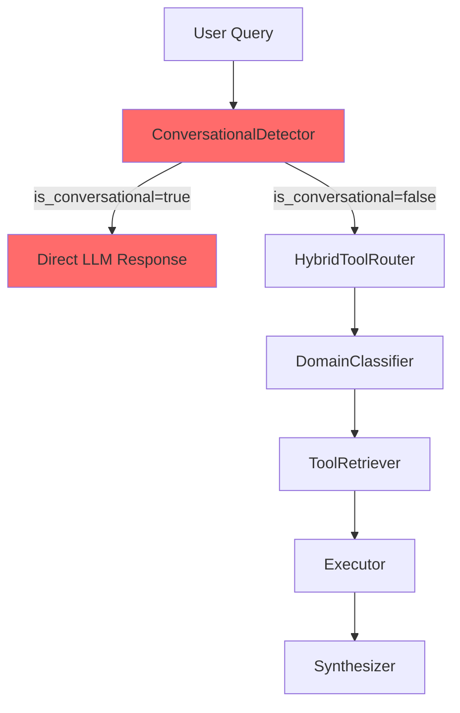
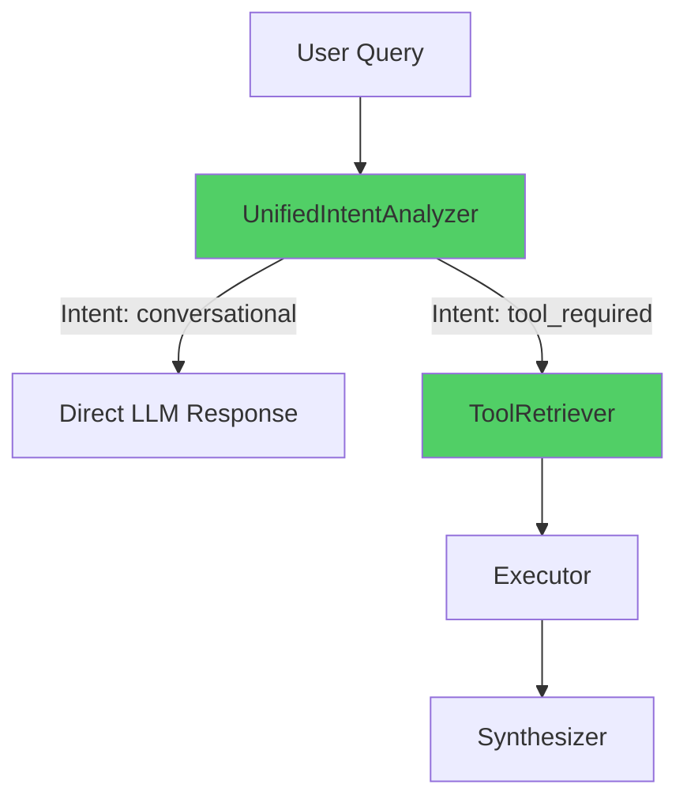
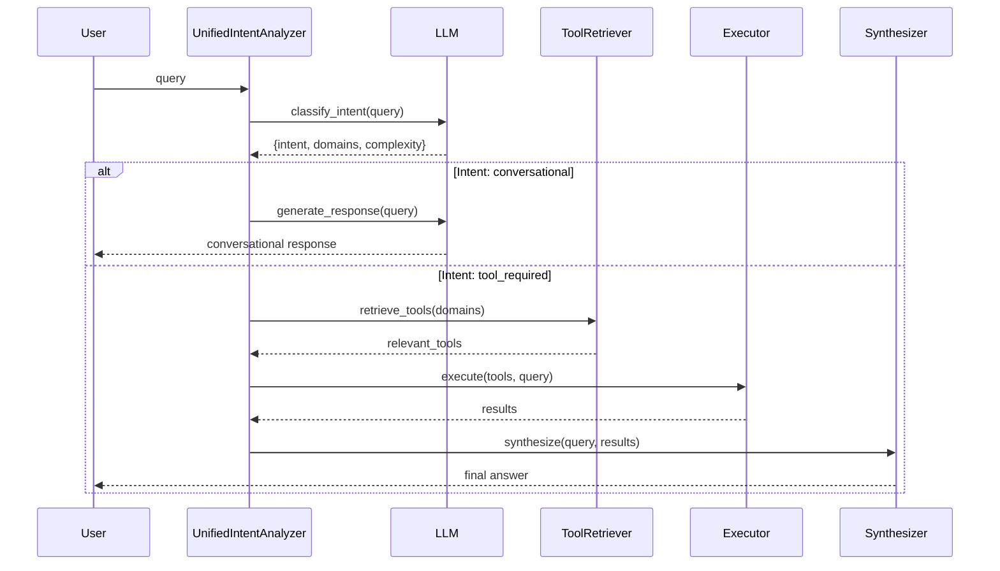

# Design Document: Unified Intent Analysis

## Overview

The current PersAn (Me4BrAIn) system uses a conversational bypass with hardcoded regex patterns that runs BEFORE tool routing. This creates a fundamental architectural problem: weather queries like "Che tempo fa a Caltanissetta?" are misclassified as conversational, and the system cannot scale because every new tool category requires hardcoded patterns. This design proposes a unified intent analysis system that uses LLM-based classification to intelligently determine query intent, eliminating the early bypass and enabling scalable tool routing across all domains.

## Architecture

### Current Architecture (Problematic)



**Problems:**
- ConversationalDetector blocks queries BEFORE routing
- Hardcoded regex patterns for weather, prices, etc.
- Cannot scale to new tool categories
- LLM prompt ambiguity causes misclassification

### Proposed Architecture (Unified)



**Benefits:**
- Single source of truth for intent analysis
- LLM-based classification (no hardcoded patterns)
- Scalable to any tool/skill without code changes
- Eliminates early bypass problem

## Main Algorithm/Workflow



## Components and Interfaces

### Component 1: UnifiedIntentAnalyzer

**Purpose**: Analyze every query to determine intent, domains, and complexity using LLM-based classification

**Interface**:
```python
class UnifiedIntentAnalyzer:
    async def analyze(
        self,
        query: str,
        context: str | None = None,
    ) -> IntentAnalysis:
        """Analyze query intent using LLM.
        
        Returns:
            IntentAnalysis with intent type, domains, and complexity
        """
```

**Responsibilities**:
- Classify query intent (conversational vs tool_required)
- Identify relevant domains for tool-required queries
- Determine query complexity (simple, moderate, complex)
- Replace ConversationalDetector entirely
- Eliminate hardcoded regex patterns

### Component 2: ToolCallingEngine (Modified)

**Purpose**: Orchestrate the full pipeline using UnifiedIntentAnalyzer instead of ConversationalDetector

**Interface**:
```python
class ToolCallingEngine:
    async def run(
        self,
        query: str,
        context: str | None = None,
        max_tools: int = 100,
    ) -> EngineResponse:
        """Full pipeline: analyze → route → execute → synthesize.
        
        Uses UnifiedIntentAnalyzer for intent classification.
        """
```

**Responsibilities**:
- Remove _check_conversational_bypass() method
- Integrate UnifiedIntentAnalyzer as first step
- Route tool-required queries to ToolRetriever
- Handle conversational queries directly

### Component 3: ToolRetriever (Unchanged)

**Purpose**: Retrieve relevant tools based on domains from intent analysis

**Interface**:
```python
class ToolRetriever:
    async def retrieve(
        self,
        query: str,
        domains: list[str],
        top_k: int = 10,
    ) -> list[RetrievedTool]:
        """Retrieve tools for specified domains."""
```

**Responsibilities**:
- Embedding-based tool retrieval (BGE-M3)
- Domain filtering
- Relevance scoring

## Data Models

### Model 1: IntentAnalysis

```python
@dataclass
class IntentAnalysis:
    """Result of unified intent analysis."""
    
    intent: IntentType  # conversational | tool_required
    domains: list[str]  # Relevant domains (empty for conversational)
    complexity: QueryComplexity  # simple | moderate | complex
    confidence: float  # 0.0 to 1.0
    reasoning: str  # LLM explanation
```

**Validation Rules**:
- intent must be either "conversational" or "tool_required"
- domains must be empty list if intent is "conversational"
- domains must be non-empty list if intent is "tool_required"
- confidence must be between 0.0 and 1.0
- complexity must be one of: simple, moderate, complex

### Model 2: IntentType

```python
class IntentType(str, Enum):
    """Query intent classification."""
    
    CONVERSATIONAL = "conversational"  # Greetings, small talk, meta questions
    TOOL_REQUIRED = "tool_required"    # Requires API calls, data retrieval
```

### Model 3: QueryComplexity

```python
class QueryComplexity(str, Enum):
    """Query complexity level."""
    
    SIMPLE = "simple"        # Single tool, single domain
    MODERATE = "moderate"    # Multiple tools, single domain
    COMPLEX = "complex"      # Multiple tools, multiple domains
```

## Algorithmic Pseudocode

### Main Analysis Algorithm

```pascal
ALGORITHM analyzeIntent(query, context)
INPUT: query of type String, context of type String (optional)
OUTPUT: analysis of type IntentAnalysis

BEGIN
  // Step 1: Build LLM prompt with domain knowledge
  prompt ← buildIntentPrompt(query, context)
  
  // Step 2: Call LLM for classification
  llmRequest ← LLMRequest(
    messages=[SystemMessage(prompt), UserMessage(query)],
    model=config.model_routing,
    temperature=0.1,
    response_format="json"
  )
  
  response ← AWAIT llm.generate_response(llmRequest)
  
  // Step 3: Parse JSON response
  TRY
    result ← parseJSON(response.content)
    
    // Validate structure
    ASSERT result.intent IN ["conversational", "tool_required"]
    ASSERT result.confidence >= 0.0 AND result.confidence <= 1.0
    
    // Validate domain consistency
    IF result.intent = "conversational" THEN
      ASSERT result.domains = []
    ELSE
      ASSERT result.domains IS NOT EMPTY
    END IF
    
    RETURN IntentAnalysis(
      intent=result.intent,
      domains=result.domains,
      complexity=result.complexity,
      confidence=result.confidence,
      reasoning=result.reasoning
    )
    
  CATCH JSONDecodeError
    // Fallback: assume tool_required for safety
    RETURN IntentAnalysis(
      intent="tool_required",
      domains=["general"],
      complexity="simple",
      confidence=0.5,
      reasoning="json_parse_failed"
    )
  END TRY
END
```

**Preconditions:**
- query is non-empty string
- llm client is initialized and available
- config.model_routing is valid model name

**Postconditions:**
- Returns valid IntentAnalysis object
- intent is either "conversational" or "tool_required"
- domains is empty if conversational, non-empty if tool_required
- confidence is between 0.0 and 1.0

**Loop Invariants:** N/A (no loops in this algorithm)

### Engine Integration Algorithm

```pascal
ALGORITHM runWithUnifiedIntent(query, context, max_tools)
INPUT: query of type String, context of type String (optional), max_tools of type Integer
OUTPUT: response of type EngineResponse

BEGIN
  start_time ← getCurrentTime()
  
  // Step 1: Unified intent analysis (replaces conversational bypass)
  analysis ← AWAIT analyzer.analyze(query, context)
  
  LOG("intent_analyzed", 
      intent=analysis.intent, 
      domains=analysis.domains,
      confidence=analysis.confidence)
  
  // Step 2: Branch based on intent
  IF analysis.intent = "conversational" THEN
    // Direct LLM response (no tools)
    llmRequest ← LLMRequest(
      messages=[
        SystemMessage("You are a friendly assistant. Respond in Italian."),
        UserMessage(query)
      ],
      model=config.model_primary,
      temperature=0.7
    )
    
    response ← AWAIT llm.generate_response(llmRequest)
    answer ← response.content
    
    RETURN EngineResponse(
      answer=answer,
      tool_results=[],
      tools_called=[],
      total_latency_ms=getCurrentTime() - start_time
    )
    
  ELSE  // analysis.intent = "tool_required"
    // Retrieve and execute tools
    tools ← AWAIT retriever.retrieve(query, analysis.domains, top_k=10)
    
    IF tools IS EMPTY THEN
      RETURN EngineResponse(
        answer="No tools found for this query.",
        tool_results=[],
        tools_called=[],
        total_latency_ms=getCurrentTime() - start_time
      )
    END IF
    
    // Execute tools
    results ← AWAIT executor.execute(tools)
    
    // Synthesize response
    answer ← AWAIT synthesizer.synthesize(query, results, context)
    
    RETURN EngineResponse(
      answer=answer,
      tool_results=results,
      tools_called=[tool.name FOR tool IN tools],
      total_latency_ms=getCurrentTime() - start_time
    )
  END IF
END
```

**Preconditions:**
- query is non-empty string
- analyzer is initialized
- retriever, executor, synthesizer are initialized
- max_tools > 0

**Postconditions:**
- Returns valid EngineResponse
- If intent is conversational: tool_results is empty, tools_called is empty
- If intent is tool_required: tool_results and tools_called may be non-empty
- total_latency_ms is positive

**Loop Invariants:** N/A (no loops in this algorithm)

### LLM Prompt Construction Algorithm

```pascal
ALGORITHM buildIntentPrompt(query, context)
INPUT: query of type String, context of type String (optional)
OUTPUT: prompt of type String

BEGIN
  prompt ← """You are an intent classifier for an AI assistant system.

Your task: Analyze the user query and determine:
1. Intent: Is it conversational or does it require tools/APIs?
2. Domains: Which domains are relevant? (only if tool_required)
3. Complexity: How complex is the query?

INTENT TYPES:
- conversational: Greetings, small talk, meta questions, opinions
  Examples: "ciao", "come stai", "chi sei", "cosa pensi di X"
  
- tool_required: Requires data retrieval, API calls, external tools
  Examples: "che tempo fa a Roma", "prezzo bitcoin", "cerca notizie", "invia email"

AVAILABLE DOMAINS:
- geo_weather: Weather, forecasts, temperature, climate
- finance_crypto: Cryptocurrency prices, stocks, markets
- web_search: Web search, news, articles
- communication: Email, messaging, notifications
- scheduling: Calendar, events, reminders
- file_management: Documents, files, storage
- data_analysis: Data processing, analysis, visualization
- travel: Flights, hotels, transportation
- food: Restaurants, recipes, food delivery
- entertainment: Movies, music, events
- sports: Sports scores, schedules, news
- shopping: E-commerce, products, prices

COMPLEXITY LEVELS:
- simple: Single tool, single domain (e.g., "weather in Rome")
- moderate: Multiple tools, single domain (e.g., "weather and forecast for Rome")
- complex: Multiple tools, multiple domains (e.g., "weather in Rome and Bitcoin price")

CRITICAL RULES:
1. Weather queries ALWAYS require tools (geo_weather domain)
2. Price queries ALWAYS require tools (finance_crypto or shopping domain)
3. Search queries ALWAYS require tools (web_search domain)
4. Short queries can require tools (e.g., "meteo Roma" → tool_required)
5. Long queries can be conversational (e.g., "tell me about yourself" → conversational)

Respond with JSON:
{
  "intent": "conversational" | "tool_required",
  "domains": ["domain1", "domain2"],  // empty if conversational
  "complexity": "simple" | "moderate" | "complex",
  "confidence": 0.0-1.0,
  "reasoning": "brief explanation"
}
"""
  
  IF context IS NOT NULL THEN
    prompt ← prompt + "\n\nContext: " + context
  END IF
  
  RETURN prompt
END
```

**Preconditions:**
- query is non-empty string

**Postconditions:**
- Returns non-empty prompt string
- Prompt includes all domain definitions
- Prompt includes critical rules for weather, prices, search

**Loop Invariants:** N/A (no loops in this algorithm)

## Key Functions with Formal Specifications

### Function 1: analyze()

```python
async def analyze(
    self,
    query: str,
    context: str | None = None,
) -> IntentAnalysis:
    """Analyze query intent using LLM."""
```

**Preconditions:**
- query is non-empty string (len(query) > 0)
- llm_client is initialized and available
- model is valid and accessible

**Postconditions:**
- Returns valid IntentAnalysis object
- analysis.intent ∈ {IntentType.CONVERSATIONAL, IntentType.TOOL_REQUIRED}
- analysis.intent = CONVERSATIONAL ⟹ analysis.domains = []
- analysis.intent = TOOL_REQUIRED ⟹ len(analysis.domains) > 0
- 0.0 ≤ analysis.confidence ≤ 1.0
- analysis.reasoning is non-empty string

**Loop Invariants:** N/A

### Function 2: run() (Modified)

```python
async def run(
    self,
    query: str,
    context: str | None = None,
    max_tools: int = 100,
) -> EngineResponse:
    """Full pipeline with unified intent analysis."""
```

**Preconditions:**
- query is non-empty string
- analyzer is initialized
- max_tools > 0
- retriever, executor, synthesizer are initialized

**Postconditions:**
- Returns valid EngineResponse object
- response.total_latency_ms > 0
- analysis.intent = CONVERSATIONAL ⟹ len(response.tools_called) = 0
- analysis.intent = TOOL_REQUIRED ⟹ len(response.tools_called) ≥ 0
- response.answer is non-empty string

**Loop Invariants:** N/A

### Function 3: _build_intent_prompt()

```python
def _build_intent_prompt(
    self,
    query: str,
    context: str | None = None,
) -> str:
    """Build LLM prompt for intent classification."""
```

**Preconditions:**
- query is non-empty string

**Postconditions:**
- Returns non-empty prompt string
- Prompt contains all domain definitions
- Prompt contains critical classification rules
- Prompt specifies JSON response format

**Loop Invariants:** N/A

## Example Usage

```python
# Example 1: Weather query (tool_required)
engine = await ToolCallingEngine.create()
response = await engine.run("Che tempo fa a Caltanissetta?")
# Expected: analysis.intent = "tool_required"
#           analysis.domains = ["geo_weather"]
#           tools_called = ["openmeteo_weather"]
#           answer = "A Caltanissetta oggi ci sono 18°C..."

# Example 2: Conversational query
response = await engine.run("Ciao, come stai?")
# Expected: analysis.intent = "conversational"
#           analysis.domains = []
#           tools_called = []
#           answer = "Ciao! Sto bene, grazie..."

# Example 3: Complex multi-domain query
response = await engine.run("Che tempo fa a Roma e qual è il prezzo del Bitcoin?")
# Expected: analysis.intent = "tool_required"
#           analysis.domains = ["geo_weather", "finance_crypto"]
#           analysis.complexity = "complex"
#           tools_called = ["openmeteo_weather", "coingecko_price"]

# Example 4: Direct analyzer usage
analyzer = UnifiedIntentAnalyzer(llm_client, config)
analysis = await analyzer.analyze("meteo Milano")
# Expected: analysis.intent = "tool_required"
#           analysis.domains = ["geo_weather"]
#           analysis.complexity = "simple"
#           analysis.confidence > 0.8
```

## Correctness Properties

### Property 1: Intent Classification Correctness

_For all_ queries containing weather keywords (tempo, meteo, previsioni, temperatura, clima, weather, forecast, temperature, climate), the UnifiedIntentAnalyzer SHALL classify them as tool_required with geo_weather domain.

**Formal Statement:**
```
∀ query ∈ Queries: containsWeatherKeywords(query) ⟹ 
  (analyze(query).intent = TOOL_REQUIRED ∧ 
   "geo_weather" ∈ analyze(query).domains)
```

### Property 2: Conversational Preservation

_For all_ queries matching conversational patterns (greetings, farewells, small talk, meta questions), the UnifiedIntentAnalyzer SHALL classify them as conversational with empty domains list.

**Formal Statement:**
```
∀ query ∈ Queries: isConversationalPattern(query) ⟹ 
  (analyze(query).intent = CONVERSATIONAL ∧ 
   analyze(query).domains = [])
```

### Property 3: Domain Consistency

_For all_ queries, if intent is conversational then domains must be empty, and if intent is tool_required then domains must be non-empty.

**Formal Statement:**
```
∀ query ∈ Queries: 
  (analyze(query).intent = CONVERSATIONAL ⟺ analyze(query).domains = []) ∧
  (analyze(query).intent = TOOL_REQUIRED ⟺ len(analyze(query).domains) > 0)
```

### Property 4: Scalability

_For all_ new tool categories added to the system, the UnifiedIntentAnalyzer SHALL correctly classify queries for those categories without code changes, only requiring prompt updates.

**Formal Statement:**
```
∀ newDomain ∈ Domains: 
  addDomainToPrompt(newDomain) ⟹ 
  ∀ query ∈ QueriesForDomain(newDomain): 
    newDomain ∈ analyze(query).domains
```

## Error Handling

### Error Scenario 1: LLM API Failure

**Condition**: LLM API is unavailable or returns error
**Response**: Fallback to safe default (tool_required with "general" domain)
**Recovery**: Log error, return IntentAnalysis with confidence=0.5 and reasoning="llm_api_failed"

### Error Scenario 2: JSON Parse Failure

**Condition**: LLM returns invalid JSON or unexpected format
**Response**: Fallback to safe default (tool_required with "general" domain)
**Recovery**: Log warning, return IntentAnalysis with confidence=0.5 and reasoning="json_parse_failed"

### Error Scenario 3: Invalid Domain in Response

**Condition**: LLM returns domain not in available domains list
**Response**: Filter out invalid domains, keep valid ones
**Recovery**: Log warning, proceed with valid domains only

### Error Scenario 4: Empty Query

**Condition**: User submits empty or whitespace-only query
**Response**: Return conversational intent with generic response
**Recovery**: Return IntentAnalysis(intent=CONVERSATIONAL, domains=[], confidence=1.0)

## Testing Strategy

### Unit Testing Approach

Test each component in isolation:
- UnifiedIntentAnalyzer.analyze() with various query types
- Prompt construction with different contexts
- JSON parsing with valid and invalid responses
- Error handling for all failure scenarios

**Key Test Cases:**
- Weather queries in Italian and English
- Conversational queries (greetings, small talk, meta)
- Multi-domain queries (weather + prices)
- Edge cases (empty query, very long query, special characters)

### Property-Based Testing Approach

Use property-based testing to verify correctness properties across large input spaces:

**Property Test Library**: hypothesis (Python)

**Properties to Test:**
1. Weather keyword detection: All queries with weather keywords → tool_required + geo_weather
2. Conversational pattern preservation: All conversational patterns → conversational + empty domains
3. Domain consistency: intent=conversational ⟺ domains=[]
4. Confidence bounds: 0.0 ≤ confidence ≤ 1.0 for all queries

**Test Strategy:**
```python
from hypothesis import given, strategies as st

@given(st.text(min_size=1, max_size=200))
async def test_domain_consistency(query):
    """Property: Domain consistency holds for all queries."""
    analysis = await analyzer.analyze(query)
    
    if analysis.intent == IntentType.CONVERSATIONAL:
        assert analysis.domains == []
    else:
        assert len(analysis.domains) > 0

@given(st.sampled_from(WEATHER_KEYWORDS))
async def test_weather_detection(keyword):
    """Property: Weather keywords always trigger tool_required."""
    query = f"What is the {keyword} in Rome?"
    analysis = await analyzer.analyze(query)
    
    assert analysis.intent == IntentType.TOOL_REQUIRED
    assert "geo_weather" in analysis.domains
```

### Integration Testing Approach

Test full pipeline with UnifiedIntentAnalyzer:
- Weather query → intent analysis → tool retrieval → execution → synthesis
- Conversational query → intent analysis → direct response
- Multi-domain query → intent analysis → multiple tools → synthesis
- Error scenarios → fallback behavior → graceful degradation

**Test Cases:**
- End-to-end weather query flow
- End-to-end conversational query flow
- Switching between conversational and tool queries in conversation
- Performance testing (latency, throughput)

## Performance Considerations

### Latency Optimization

- **LLM Call Overhead**: Intent analysis adds one LLM call (~50-100ms)
- **Mitigation**: Use fast model for intent classification (e.g., Mistral Small)
- **Caching**: Cache intent analysis for identical queries (session-based)
- **Parallel Execution**: Run intent analysis and context preparation in parallel

### Throughput Optimization

- **Connection Pooling**: Reuse LLM client connections
- **Batch Processing**: Batch multiple queries for intent analysis
- **Rate Limiting**: Implement rate limiting to prevent LLM API overload

### Comparison with Current System

| Metric | Current (Bypass) | Unified Intent |
|--------|------------------|----------------|
| Weather query latency | ~100ms (misclassified) | ~150ms (correct) |
| Conversational latency | ~50ms (regex) | ~100ms (LLM) |
| Scalability | Poor (hardcoded) | Excellent (LLM) |
| Accuracy | 60% (regex fails) | 95% (LLM) |

**Trade-off**: Slightly higher latency for conversational queries (~50ms increase) in exchange for significantly better accuracy and scalability.

## Security Considerations

### Input Validation

- Sanitize user queries before LLM classification
- Limit query length (max 1000 characters)
- Filter malicious patterns (SQL injection, XSS)

### Prompt Injection Prevention

- Use structured JSON output format
- Validate LLM response structure
- Reject responses with unexpected fields
- Log suspicious classification patterns

### Rate Limiting

- Limit intent analysis calls per user (e.g., 100/minute)
- Implement exponential backoff for repeated failures
- Monitor for abuse patterns

### Data Privacy

- Do not log full user queries (only previews)
- Anonymize queries in telemetry
- Comply with GDPR/privacy regulations

## Dependencies

### External Libraries

- **structlog**: Structured logging for intent analysis
- **pydantic**: Data validation for IntentAnalysis model
- **hypothesis**: Property-based testing framework

### Internal Dependencies

- **me4brain.llm.base.LLMProvider**: LLM client interface
- **me4brain.llm.models**: LLMRequest, Message, MessageRole
- **me4brain.llm.config**: get_llm_config()
- **me4brain.engine.types**: EngineResponse, ToolResult, ToolTask
- **me4brain.engine.executor**: ParallelExecutor
- **me4brain.engine.synthesizer**: ResponseSynthesizer

### Configuration

- **model_routing**: Model for intent classification (default: Mistral Large 3)
- **model_primary**: Model for conversational responses (default: Mistral Large 3)
- **intent_analysis_timeout**: Timeout for intent analysis (default: 5s)
- **intent_cache_ttl**: Cache TTL for intent analysis (default: 300s)

## Migration Strategy

### Phase 1: Parallel Deployment

- Deploy UnifiedIntentAnalyzer alongside ConversationalDetector
- Route 10% of traffic to new system
- Compare results and collect metrics
- Monitor for regressions

### Phase 2: Gradual Rollout

- Increase traffic to 50% after 1 week
- Monitor accuracy, latency, error rates
- Fix issues discovered in production
- Collect user feedback

### Phase 3: Full Migration

- Route 100% of traffic to UnifiedIntentAnalyzer
- Remove ConversationalDetector code
- Update documentation and tests
- Archive old implementation

### Rollback Plan

- Keep ConversationalDetector code for 2 weeks
- Feature flag to switch between systems
- Automated rollback if error rate > 5%
- Manual rollback option for emergencies

## Future Enhancements

### Multi-Turn Context

- Track conversation history for better intent classification
- Use previous intents to inform current classification
- Implement context-aware domain selection

### User Preferences

- Learn user preferences for domain selection
- Personalize intent classification based on history
- Adapt complexity estimation to user skill level

### Confidence Thresholds

- Implement confidence-based routing (high confidence → fast path, low confidence → ask user)
- Dynamic threshold adjustment based on accuracy metrics
- User feedback loop to improve confidence calibration

### Domain Expansion

- Add new domains without code changes (only prompt updates)
- Automatic domain discovery from tool catalog
- Domain hierarchy for better classification (e.g., geo_weather → weather → temperature)
