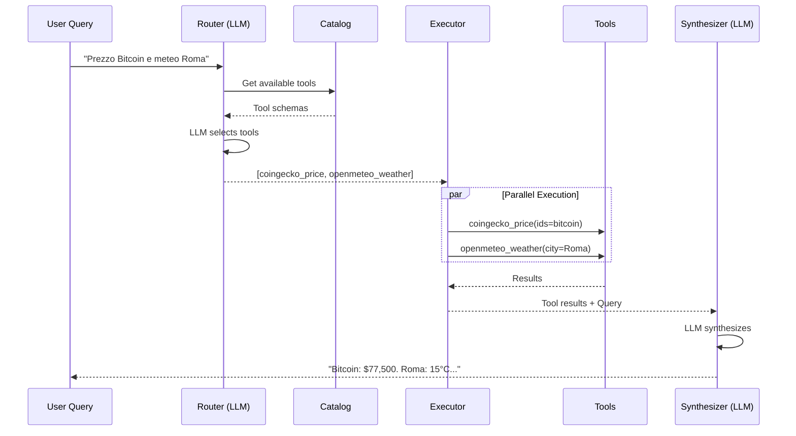

# Tool Calling Engine - Developer Guide

Questa guida documenta il **Tool Calling Engine**, il sistema modulare per l'esecuzione di tool attraverso query in linguaggio naturale.

---

## Architettura

```
┌─────────────────────────────────────────────────────────────────┐
│                    Tool Calling Engine                          │
├─────────────────────────────────────────────────────────────────┤
│                                                                 │
│   ┌──────────┐    ┌──────────┐    ┌─────────────┐              │
│   │  Router  │───▶│ Executor │───▶│ Synthesizer │              │
│   │   LLM    │    │ Parallel │    │    LLM      │              │
│   └──────────┘    └──────────┘    └─────────────┘              │
│        │               │                                        │
│        ▼               ▼                                        │
│   ┌──────────────────────────┐                                 │
│   │       Tool Catalog       │                                 │
│   │   (Auto-discovery)       │                                 │
│   └──────────────────────────┘                                 │
│                                                                 │
│   126 Tools │ 14 Domains                                       │
│                                                                 │
└─────────────────────────────────────────────────────────────────┘
```

### Componenti Core

| Componente            | File                    | Responsabilità                          |
| --------------------- | ----------------------- | --------------------------------------- |
| **ToolCatalog**       | `engine/catalog.py`     | Registry tool con auto-discovery        |
| **Router**            | `engine/router.py`      | LLM function calling per selezione tool |
| **Executor**          | `engine/executor.py`    | Esecuzione parallela con timeout/retry  |
| **Synthesizer**       | `engine/synthesizer.py` | Sintesi risposta da risultati tool      |
| **ToolCallingEngine** | `engine/core.py`        | Orchestrazione pipeline completo        |

---

## Hybrid Router (v2.0)

Il sistema di routing è stato aggiornato con **Hybrid Router** che utilizza LlamaIndex per retrieval semantico e **Query Decomposition** per query multi-intent.

### Local-Only Routing Policy (`llm_local` branch)

Nel branch `llm_local` la pipeline è progettata per usare **solo modelli locali** per:

- intent analysis
- domain classification
- tool selection / tool-calling
- synthesis

Il fallback cloud è disabilitato di default.

#### Flag runtime principali

```env
LLM_LOCAL_ONLY=true
LLM_ALLOW_CLOUD_FALLBACK=false

USE_UNIFIED_INTENT_ANALYZER=false
USE_STAGE0_INTENT_ANALYZER=true
USE_CONTEXT_REWRITE_FOR_ROUTING=true
USE_QUERY_DECOMPOSITION=true
```

#### Effetto dei flag

- `LLM_LOCAL_ONLY=true`: blocca la risoluzione di modelli cloud in `provider_factory`.
- `LLM_ALLOW_CLOUD_FALLBACK=false`: impedisce fallback a provider cloud anche in caso di errore locale.
- `USE_UNIFIED_INTENT_ANALYZER`: abilita/disabilita il percorso Unified Intent nel core.
- `USE_STAGE0_INTENT_ANALYZER`: abilita/disabilita lo Stage 0 semantico nel router ibrido.
- `USE_CONTEXT_REWRITE_FOR_ROUTING`: controlla il rewriting contestuale prima del routing.
- `USE_QUERY_DECOMPOSITION`: controlla la decomposizione multi-intent.

#### Rollout controllato Unified Intent

Il core supporta anche gradual rollout tramite `FeatureFlagManager`:

- `UNIFIED_INTENT_ROLLOUT_PHASE=disabled|canary|beta|production`
- `UNIFIED_INTENT_TRAFFIC_PERCENTAGE=<0-100>`

Se `USE_UNIFIED_INTENT_ANALYZER=true`, il flag ha priorità e forzerà Unified Intent.

### Architettura Three-Stage

```
┌──────────────────────────────────────────────────────────────────────────┐
│                          Hybrid Tool Router                               │
├──────────────────────────────────────────────────────────────────────────┤
│                                                                          │
│  ┌─────────────────┐    ┌──────────────────┐    ┌─────────────────┐     │
│  │ Stage 1:        │───▶│ Stage 1b:        │───▶│ Stage 2:        │     │
│  │ Domain          │    │ Query            │    │ Tool Retrieval  │     │
│  │ Classification  │    │ Decomposition    │    │ (LlamaIndex)    │     │
│  └─────────────────┘    └──────────────────┘    └─────────────────┘     │
│         │                       │                       │                │
│         ▼                       ▼                       ▼                │
│  ┌─────────────────┐    ┌──────────────────┐    ┌─────────────────┐     │
│  │ DomainClassifier│    │ QueryDecomposer  │    │ LlamaIndex      │     │
│  │ (Mistral LLM)   │    │ (Single-domain)  │    │ VectorRetriever │     │
│  └─────────────────┘    └──────────────────┘    └─────────────────┘     │
│                                                          │               │
│                                                          ▼               │
│                                                 ┌─────────────────┐      │
│                                                 │ LLM Reranker    │      │
│                                                 │ (+15-25% prec)  │      │
│                                                 └─────────────────┘      │
│                                                                          │
│  130 Tools │ 14 Domains │ BGE-M3 Embeddings │ Qdrant VectorStore        │
└──────────────────────────────────────────────────────────────────────────┘
```

### Componenti Hybrid Router

| Componente                  | File                                    | Responsabilità                    |
| --------------------------- | --------------------------------------- | --------------------------------- |
| **DomainClassifier**        | `hybrid_router/domain_classifier.py`    | Classifica query in domini        |
| **QueryDecomposer**         | `hybrid_router/query_decomposer.py`     | Decompone query multi-intent      |
| **ToolIndexManager**        | `hybrid_router/tool_index.py`           | Gestisce indice Qdrant con BGE-M3 |
| **LlamaIndexToolRetriever** | `hybrid_router/llama_tool_retriever.py` | Retrieval 2-stage con rerank      |
| **HybridToolRouter**        | `hybrid_router/router.py`               | Orchestrazione pipeline           |

### Query Decomposition

Per query multi-intent (es. "Cerca email ANCI poi cerca volo per Roma"):

```
Query: "Cerca email ANCI poi cerca volo Roma"
       ↓
DomainClassifier: [google_workspace, travel]
       ↓
QueryDecomposer.should_decompose() = True (multi-domain + keyword "poi")
       ↓
QueryDecomposer.decompose():
  - SubQuery(text="cerca email ANCI", domain="google_workspace", intent="email_search")
  - SubQuery(text="cerca volo Roma", domain="travel", intent="flight_search")
       ↓
retrieve_multi_intent():
  - Retrieval google_workspace → [gmail_search, drive_search, ...]
  - Retrieval travel → [aviationstack_flight, ...]
       ↓
RRF Merge: score(d) = Σ 1/(k + rank)
       ↓
Final tools: [gmail_search (0.56), aviationstack_flight (0.50), ...]
```

### Configurazione Soglie

```python
HybridRouterConfig(
    # Stage 1: Domain classification
    router_model="mistralai/mistral-large-3-675b-instruct-2512",
    confidence_threshold=0.7,
    
    # Stage 2: Retrieval
    use_llamaindex_retrieval=True,  # Default: abilitato
    coarse_top_k=30,                # Candidati iniziali
    rerank_top_n=15,                # Tool finali dopo rerank
    min_similarity_score=0.48,      # Soglia BGE-M3 (ottimale)
    
    # LLM Reranker
    use_llm_reranker=True,          # +15-25% precision
    reranker_model="mistralai/mistral-large-3-675b-instruct-2512",
)
```

## Flusso di Esecuzione



---

## API Endpoints

Base URL: `/v1/engine`

### POST /query

Esegue una query in linguaggio naturale attraverso il pipeline completo.

**Request:**
```json
{
    "query": "Qual è il prezzo del Bitcoin?",
    "stream": false,
    "include_raw_results": false,
    "timeout_seconds": 30.0
}
```

**Response:**
```json
{
    "query": "Qual è il prezzo del Bitcoin?",
    "answer": "Il Bitcoin viene scambiato attualmente a $77,500 USD...",
    "tools_called": [
        {
            "tool_name": "coingecko_price",
            "arguments": {"ids": "bitcoin", "vs_currencies": "usd"},
            "success": true,
            "latency_ms": 324.5,
            "error": null
        }
    ],
    "total_latency_ms": 8083.52,
    "raw_results": null
}
```

### POST /call

Chiamata diretta a un tool.

**Request:**
```json
{
    "tool_name": "coingecko_price",
    "arguments": {
        "ids": "bitcoin",
        "vs_currencies": "usd"
    }
}
```

**Response:**
```json
{
    "tool_name": "coingecko_price",
    "success": true,
    "result": {
        "prices": {"bitcoin": {"usd": 77500}},
        "source": "CoinGecko"
    },
    "error": null,
    "latency_ms": 350.2
}
```

### GET /tools

Lista tool disponibili con filtri.

**Query Parameters:**
- `domain` (optional): Filtra per dominio
- `category` (optional): Filtra per categoria
- `search` (optional): Cerca in nome/descrizione

**Response:**
```json
{
    "tools": [
        {
            "name": "coingecko_price",
            "description": "Get cryptocurrency prices from CoinGecko",
            "domain": "finance_crypto",
            "category": "crypto",
            "parameters": {
                "ids": {
                    "type": "string",
                    "description": "Comma-separated coin IDs",
                    "required": true
                },
                "vs_currencies": {
                    "type": "string",
                    "description": "Target currencies",
                    "required": false
                }
            }
        }
    ],
    "total": 126,
    "domains": ["finance_crypto", "geo_weather", ...]
}
```

### GET /tools/{name}

Dettagli singolo tool.

### GET /stats

Statistiche catalog.

**Response:**
```json
{
    "total_tools": 126,
    "domains": [
        {
            "domain": "google_workspace",
            "tool_count": 38,
            "tools": ["google_drive_search", "google_gmail_send", ...]
        },
        {
            "domain": "finance_crypto",
            "tool_count": 15,
            "tools": ["coingecko_price", "yahoo_quote", ...]
        }
    ]
}
```

---

## Aggiungere un Nuovo Tool

### 1. Definire il ToolDefinition

```python
# src/me4brain/domains/your_domain/tools/your_api.py

from me4brain.engine.types import ToolDefinition, ToolParameter

# Definizione del tool
my_tool = ToolDefinition(
    name="my_domain_action",        # Convenzione: domain_action
    description="Description for LLM to understand when to use this tool",
    domain="my_domain",
    category="subcategory",
    parameters={
        "required_param": ToolParameter(
            type="string",
            description="Description of this parameter",
            required=True,
        ),
        "optional_param": ToolParameter(
            type="integer",
            description="Optional parameter with default",
            required=False,
            default=10,
        ),
    },
)
```

### Tool Description Best Practices

Le descrizioni dei tool sono fondamentali per il **semantic routing**. Seguire queste best practices per ottimizzare l'embedding matching:

#### 1. Lingua e Struttura

```python
# ❌ Evitare: descrizioni generiche/multilingue
description="Cerca film nel database"

# ✅ Preferire: inglese, action-oriented
description="Search for movies on TMDB (The Movie Database)..."
```

#### 2. Pattern Consigliato

```python
description="[ACTION] [WHAT] [FROM/ON SOURCE]. [ADDITIONAL CONTEXT]. Use when user asks '[EXAMPLE 1]', '[EXAMPLE 2]', '[EXAMPLE 3]'."
```

**Esempi reali:**

```python
# Movies/Entertainment
description="Search for movies on TMDB (The Movie Database). Find films by title, returns posters, ratings, and overviews. Use when user asks 'find movie X', 'search for film Y', 'what movies about Z'."

# Weather
description="Get current weather conditions for any city worldwide from OpenMeteo (free). Returns temperature, humidity, and conditions. Use when user asks 'weather in X', 'is it raining in Y'."

# Finance
description="Get real-time cryptocurrency prices from CoinGecko. Returns prices in USD/EUR. Use when user asks 'Bitcoin price', 'how much is Ethereum', 'crypto prices'."
```

#### 3. Componenti Chiave

| Componente          | Scopo                 | Esempio                                      |
| ------------------- | --------------------- | -------------------------------------------- |
| **Action Verb**     | Indica l'azione       | Get, Search, Find, Create, List, Track       |
| **Source**          | Indica la fonte dati  | "from CoinGecko", "on TMDB", "via OpenMeteo" |
| **Returns**         | Cosa viene restituito | "Returns prices, ratings, locations..."      |
| **Trigger Phrases** | Query naturali        | "Use when user asks 'X', 'Y', 'Z'"           |

#### 4. Parametri con Esempi

```python
# ❌ Evitare: parametri generici
ToolParameter(type="string", description="Query di ricerca", required=True)

# ✅ Preferire: esempi concreti
ToolParameter(
    type="string", 
    description="Movie title to search (e.g., 'Inception', 'The Matrix')", 
    required=True
)
```

### 2. Implementare l'Executor

```python
async def my_tool_executor(
    required_param: str,
    optional_param: int = 10,
) -> dict:
    """Executor function - MUST be async."""
    # Implementazione
    async with httpx.AsyncClient() as client:
        response = await client.get(
            "https://api.example.com/endpoint",
            params={"q": required_param, "limit": optional_param},
        )
        return response.json()
```

### 3. Registrare nel Modulo

```python
# Lista di tutti i tool nel modulo
TOOL_DEFINITIONS = [
    my_tool,
    other_tool,
]

# Mappatura nome → executor
EXECUTORS = {
    "my_domain_action": my_tool_executor,
    "my_domain_other": other_executor,
}


def get_tool_definitions() -> list[ToolDefinition]:
    """Ritorna le definizioni dei tool per auto-discovery."""
    return TOOL_DEFINITIONS


def get_executors() -> dict[str, Callable]:
    """Ritorna gli executor per auto-discovery."""
    return EXECUTORS
```

### 4. Esportare in __init__.py

```python
# src/me4brain/domains/your_domain/tools/__init__.py

from .your_api import (
    get_tool_definitions,
    get_executors,
)

__all__ = ["get_tool_definitions", "get_executors"]
```

### 5. Auto-Discovery

Il `ToolCatalog.discover_from_domains()` scansiona automaticamente:

```
me4brain/domains/
├── your_domain/
│   └── tools/
│       ├── __init__.py      # Esporta get_tool_definitions, get_executors
│       └── your_api.py      # Implementazione
```

---

## Configurazione LLM

Il Router e Synthesizer usano configurazioni LLM separate:

```python
from me4brain.engine import ToolCallingEngine, LLMConfig

# Configurazione custom
engine = await ToolCallingEngine.create(
    routing_llm=LLMConfig(
        model="mistralai/mistral-large-3",
        temperature=0.0,        # Deterministic per routing
        max_tokens=1024,
    ),
    synthesis_llm=LLMConfig(
        model="moonshotai/kimi-k2-instruct",
        temperature=0.7,        # Più creativo per sintesi
        max_tokens=4096,
    ),
)
```

---

## Metriche e Logging

Il sistema usa `structlog` per logging strutturato:

```python
# Esempio log output
2026-02-01 18:05:07 [info] router_decision tool_names=['coingecko_price'] tools_selected=1
2026-02-01 18:05:07 [info] executor_complete failed=0 successful=1 total_latency_ms=325.45
2026-02-01 18:05:13 [info] synthesizer_complete answer_length=480 tools_used=1
2026-02-01 18:05:13 [info] engine_run_complete total_latency_ms=8083.52
```

---

## Domini Disponibili

| Dominio            | Tools | APIs                                                                 |
| ------------------ | ----- | -------------------------------------------------------------------- |
| `google_workspace` | 38    | Drive, Gmail, Calendar, Docs, Sheets, Slides, Meet, Forms, Classroom |
| `finance_crypto`   | 15    | CoinGecko, Binance, Yahoo, Finnhub, FRED, EDGAR, Alpaca, Hyperliquid |
| `sports_nba`       | 10    | BallDontLie, ESPN, The Odds API, nba_api                             |
| `tech_coding`      | 10    | GitHub, NPM, PyPI, Stack Overflow, Piston                            |
| `medical`          | 9     | RxNorm, PubMed, ClinicalTrials.gov, Europe PMC, iCite                |
| `travel`           | 8     | OpenSky, AviationStack, ADS-B One                                    |
| `science_research` | 7     | ArXiv, Crossref, OpenAlex, Semantic Scholar                          |
| `entertainment`    | 6     | TMDB, Open Library, Last.fm                                          |
| `food`             | 6     | TheMealDB, Open Food Facts                                           |
| `geo_weather`      | 5     | OpenMeteo, USGS Earthquakes, Nager Holidays                          |
| `web_search`       | 4     | DuckDuckGo, Tavily                                                   |
| `knowledge_media`  | 3     | Wikipedia, Hacker News, Open Library                                 |
| `jobs`             | 2     | RemoteOK, Arbeitnow                                                  |
| `utility`          | 2     | httpbin                                                              |

---

## Test

### Unit Test con pytest

```bash
# Test engine
python scripts/test_engine.py

# Benchmark multi-domain
python scripts/test_multidomain.py --benchmark

# Test API endpoints (richiede server running)
python scripts/test_engine_api.py --base-url http://localhost:8000
```

### Test Interattivo

```bash
python scripts/test_multidomain.py

# Comandi disponibili:
# /tools - Lista tools
# /benchmark - Esegui benchmark
# /verbose - Toggle debug output
# /quit - Esci
```

---

## Troubleshooting

### Tool non trovato

```
Tool not found: wrong_name
```

**Soluzione:** Verificare che il tool sia registrato in `get_tool_definitions()` e che il nome corrisponda.

### Timeout

```
Tool execution timed out after 30s
```

**Soluzione:** Aumentare il timeout o verificare che l'API esterna sia raggiungibile.

### Import Error

```
ImportError: cannot import name 'get_tool_definitions'
```

**Soluzione:** Verificare che `__init__.py` esporti correttamente le funzioni.

---

## Vedi Anche

- [SDK Documentation](../sdk/README.md) - Client Python
- [API Catalog](API_CATALOG.md) - Lista completa API
- [Architecture Overview](architecture/OVERVIEW.md) - Architettura generale
