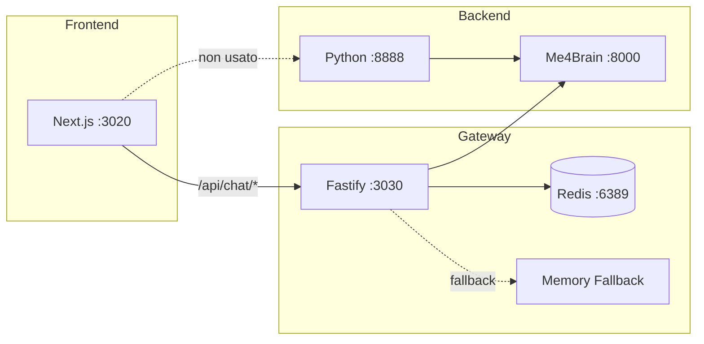
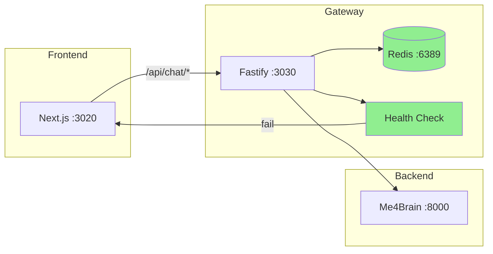

# Piano di Implementazione - Fix Criticità Frontend PersAn

**Versione:** 1.0  
**Data:** 2026-02-17  
**Basato su:** `docs/reports/PERSAN_FRONTEND_BUG_REPORT.md`  
**Ambiente Target:** Server GIC-com

---

## 📋 Sommario

Questo piano definisce le implementazioni necessarie per risolvere le 7 criticità principali e i 12 bug minori identificati nell'analisi. Le modifiche sono organizzate in 3 fasi con dipendenze esplicite.

---

## 🏗️ Architettura Target

### Stato Attuale (Problematico)



### Stato Target (Risolto)



---

## 🔴 FASE 1: Hotfix Critici

**Obiettivo:** Ripristinare funzionalità base in produzione  
**Priorità:** Immediata  
**Prerequisiti:** Accesso al server Geekcom

### TASK 1.1: Configurazione CORS Gateway

**File:** `persan/packages/gateway/src/app.ts`

**Problema:** CORS configurato per accettare tutto, ma il backend Python ha CORS restrittivo.

**Soluzione:** Il Gateway è già configurato correttamente. Verificare che il frontend chiami il Gateway (porta 3030) e NON il backend Python.

**Verifica:**
```bash
curl -I http://GIC-com:3030/api/chat/sessions
# Deve restituire: Access-Control-Allow-Origin: *
```

---

### TASK 1.2: Verifica e Fix Connessione Redis

**File:** `persan/packages/gateway/src/services/chat_session_store.ts`

**Problema:** Fallback silenzioso a memoria in-memory se Redis non disponibile.

**Implementazione:**

```typescript
// FILE: persan/packages/gateway/src/services/chat_session_store.ts
// MODIFICA: Linee 59-99

private initRedis(): void {
    const redisUrl = process.env.REDIS_URL ?? 'redis://localhost:6389';
    const redisPassword = process.env.REDIS_PASSWORD;

    const opts: Record<string, unknown> = {
        maxRetriesPerRequest: 3,  // Aumentato da 2
        retryStrategy: (times: number) => {
            if (times > 5) {
                // Log critico e NOTifica
                console.error('🔴 CRITICAL: Redis connection failed after 5 retries');
                return null;
            }
            return Math.min(times * 500, 5000);  // Backoff più graduale
        },
        lazyConnect: false,  // Connetti immediatamente, non lazy
        connectTimeout: 10000,  // 10 secondi timeout
    };

    if (redisPassword) opts.password = redisPassword;

    this.redis = new Redis(redisUrl, opts);

    this.redis.on('connect', () => {
        this.redisAvailable = true;
        console.log('✅ ChatSessionStore: Redis connected');
    });

    this.redis.on('error', (err: Error) => {
        this.redisAvailable = false;
        // CAMBIATO: Log con livello ERROR
        console.error('🔴 CRITICAL: ChatSessionStore Redis error:', err.message);
        
        // AGGIUNTO: Notifica il sistema di health check
        this._redisHealthy = false;
    });

    this.redis.on('close', () => {
        this.redisAvailable = false;
        console.warn('⚠️ ChatSessionStore: Redis connection closed');
    });

    // RIMOSSO: catch silenzioso
    // AGGIUNTO: Connessione sincrona con errore fatale
    this.redis.connect().then(() => {
        console.log('✅ Redis connection established');
    }).catch((err) => {
        console.error('🔴 FATAL: Cannot connect to Redis:', err.message);
        console.error('🔴 Session persistence will NOT work!');
        // Non usare fallback in-memory in produzione
        if (process.env.NODE_ENV === 'production') {
            process.exit(1);  // Fail fast in produzione
        }
        this.redisAvailable = false;
    });
}

// AGGIUNTO: Metodo per health check
isRedisHealthy(): boolean {
    return this.redisAvailable && this._redisHealthy;
}
```

**Nuovo Health Check Endpoint:**

```typescript
// FILE: persan/packages/gateway/src/routes/index.ts
// AGGIUNGERE dopo linea 23:

import { chatSessionStore } from '../services/chat_session_store.js';

// Modificare /health endpoint
app.get('/health', async () => {
    const redisHealthy = chatSessionStore.isRedisHealthy?.() ?? false;
    
    return {
        status: redisHealthy ? 'healthy' : 'degraded',
        timestamp: new Date().toISOString(),
        version: '0.1.0',
        uptime: process.uptime(),
        components: {
            redis: redisHealthy ? 'connected' : 'disconnected',
            me4brain: 'unknown',  // TODO: aggiungere check
        },
    };
});

// AGGIUNGERE: /health/ready per Kubernetes
app.get('/health/ready', async (request, reply) => {
    const redisHealthy = chatSessionStore.isRedisHealthy?.() ?? false;
    
    if (!redisHealthy) {
        return reply.status(503).send({
            status: 'not_ready',
            reason: 'Redis unavailable',
        });
    }
    
    return { status: 'ready' };
});
```

---

### TASK 1.3: Configurazione Variabili Ambiente Frontend

**File:** `persan/frontend/.env.production` (NUOVO)

**Creare file:**

```bash
# FILE: persan/frontend/.env.production
# Configurazione per produzione su Geekcom

# API Gateway - HTTP requests
NEXT_PUBLIC_API_URL=http://100.99.43.29:3030

# WebSocket Gateway - Real-time streaming
NEXT_PUBLIC_GATEWAY_URL=[ws://GIC-com](http://100.99.43.29):3030/ws

# Push Notifications (se configurato)
NEXT_PUBLIC_VAPID_PUBLIC_KEY=BL4oiu3dW48y7DG0O3nuJixDGVaXMjepI4aYvlAI4bbnDRVawfUO3NaAUB7KDpXZ6dO7_HLfD3jxjvpZKb0mrCo

# Environment
NEXT_PUBLIC_ENV=production
```

**File:** `persan/frontend/.env.development` (NUOVO)

```bash
# FILE: persan/frontend/.env.development
# Configurazione per sviluppo locale

NEXT_PUBLIC_API_URL=http://localhost:3030
NEXT_PUBLIC_GATEWAY_URL=ws://localhost:3030/ws
NEXT_PUBLIC_ENV=development
```

---

### TASK 1.4: Rimuovere Hardcoded URL Fallback

**File:** `persan/frontend/src/stores/useChatStore.ts`

**Modifica:**

```typescript
// FILE: persan/frontend/src/stores/useChatStore.ts
// MODIFICA: Linea 13

// PRIMA:
const API_URL = process.env.NEXT_PUBLIC_API_URL || 'http://100.99.43.29:3030';

// DOPO:
const API_URL = (() => {
    const url = process.env.NEXT_PUBLIC_API_URL;
    if (!url) {
        if (typeof window !== 'undefined') {
            console.error('🔴 NEXT_PUBLIC_API_URL non configurato!');
            // Fallback a window.location per sviluppo locale
            return `${window.location.protocol}//${window.location.hostname}:3030`;
        }
        return 'http://localhost:3030';  // Solo per SSR
    }
    return url;
})();
```

**File:** `persan/frontend/src/hooks/useChat.ts`

**Modifica identica:**

```typescript
// FILE: persan/frontend/src/hooks/useChat.ts
// MODIFICA: Inizio file

const API_URL = (() => {
    const url = process.env.NEXT_PUBLIC_API_URL;
    if (!url) {
        if (typeof window !== 'undefined') {
            console.error('🔴 NEXT_PUBLIC_API_URL non configurato!');
            return `${window.location.protocol}//${window.location.hostname}:3030`;
        }
        return 'http://localhost:3030';
    }
    return url;
})();
```

**File:** `persan/frontend/src/hooks/useGateway.ts`

**Modifica:**

```typescript
// FILE: persan/frontend/src/hooks/useGateway.ts
// MODIFICA: Inizio file

const GATEWAY_URL = (() => {
    const url = process.env.NEXT_PUBLIC_GATEWAY_URL;
    if (!url) {
        if (typeof window !== 'undefined') {
            const protocol = window.location.protocol === 'https:' ? 'wss:' : 'ws:';
            return `${protocol}//${window.location.hostname}:3030/ws`;
        }
        return 'ws://localhost:3030/ws';
    }
    return url;
})();
```

---

## 🟠 FASE 2: Stabilizzazione Architettura

**Obiettivo:** Eliminare duplicazione e stabilizzare persistenza  
**Prerequisiti:** Fase 1 completata

### TASK 2.1: Unificare Architettura Backend

**Decisione:** Mantenere SOLO il Gateway TypeScript, rimuovere il Backend Python dalle chiamate frontend.

**Motivazione:**
- Gateway ha tutti gli endpoint necessari
- Gateway usa Redis per persistenza
- Backend Python è ridondante per il frontend

**Implementazione:**

1. **Verificare che il frontend chiami solo il Gateway:**

```typescript
// FILE: persan/frontend/src/lib/config.ts (NUOVO)
/**
 * Configurazione centralizzata per API e WebSocket.
 * Tutti i componenti DEVONO usare queste costanti.
 */

export const API_CONFIG = {
    get apiUrl() {
        const url = process.env.NEXT_PUBLIC_API_URL;
        if (!url && typeof window !== 'undefined') {
            return `${window.location.protocol}//${window.location.hostname}:3030`;
        }
        return url || 'http://localhost:3030';
    },
    
    get gatewayUrl() {
        const url = process.env.NEXT_PUBLIC_GATEWAY_URL;
        if (!url && typeof window !== 'undefined') {
            const protocol = window.location.protocol === 'https:' ? 'wss:' : 'ws:';
            return `${protocol}//${window.location.hostname}:3030/ws`;
        }
        return url || 'ws://localhost:3030/ws';
    },
    
    get timeout() {
        return parseInt(process.env.NEXT_PUBLIC_API_TIMEOUT || '300000', 10);  // 5 min default
    },
};

// Validazione all'avvio
if (typeof window !== 'undefined' && !process.env.NEXT_PUBLIC_API_URL) {
    console.warn('⚠️ NEXT_PUBLIC_API_URL non configurato, usando fallback automatico');
}
```

2. **Aggiornare tutti i file che usano API_URL:**

```typescript
// FILE: persan/frontend/src/stores/useChatStore.ts
// MODIFICA: Importare da config

import { API_CONFIG } from '@/lib/config';

// Sostituire tutte le occorrenze di API_URL con API_CONFIG.apiUrl
// Esempio:
const response = await fetch(`${API_CONFIG.apiUrl}/api/chat/sessions`);
```

---

### TASK 2.2: Fix Persistenza localStorage

**File:** `persan/frontend/src/stores/useChatStore.ts`

**Problema:** Conflitto tra localStorage e stato server.

**Soluzione:** Persistere SOLO `currentSessionId`, non i messaggi.

```typescript
// FILE: persan/frontend/src/stores/useChatStore.ts
// MODIFICA: Linee 518-550

export const useChatStore = create<ChatState>()(
    persist(
        (set, get) => ({
            // ... resto dello store invariato ...
        }),
        {
            name: 'persan-chat-storage',
            storage: createJSONStorage(() => localStorage),
            // MODIFICA: Persistere solo currentSessionId, NON i messaggi
            partialize: (state) => ({
                currentSessionId: state.currentSessionId,
                // RIMOSSO: sessionStates con messaggi
                // I messaggi vengono caricati dal server tramite loadSession()
            }),
            // AGGIUNTO: Versione dello schema per migrazioni future
            version: 2,
            // AGGIUNTO: Migrazione da vecchio schema
            migrate: (persisted: any, version: number) => {
                if (version < 2) {
                    // Vecchio schema aveva sessionStates con messaggi
                    // Estrai solo currentSessionId
                    return {
                        currentSessionId: persisted.currentSessionId ?? null,
                    };
                }
                return persisted;
            },
        }
    )
);
```

---

### TASK 2.3: Fix Endpoint PATCH con Body JSON

**File:** `persan/packages/gateway/src/routes/chat.ts`

**Modifica:**

```typescript
// FILE: persan/packages/gateway/src/routes/chat.ts
// MODIFICA: Linee 228-248

interface PatchSessionBody {
    title?: string;
    config?: SessionConfig;
}

app.patch<{ Params: SessionParams; Body: PatchSessionBody }>(
    '/api/chat/sessions/:id',
    async (
        request: FastifyRequest<{ Params: SessionParams; Body: PatchSessionBody }>,
        reply: FastifyReply
    ) => {
        const { id } = request.params;
        const { title } = request.body;  // Legge dal body, non da query

        if (!title) {
            return reply.status(400).send({ error: 'Title is required in request body' });
        }

        const updated = await chatSessionStore.updateTitle(id, title);
        if (!updated) {
            return reply.status(404).send({ error: 'Session not found' });
        }

        return reply.send({ success: true, session_id: id, title });
    }
);
```

**File:** `persan/frontend/src/stores/useChatStore.ts`

**Modifica:**

```typescript
// FILE: persan/frontend/src/stores/useChatStore.ts
// MODIFICA: Linee 474-491

updateSessionTitle: async (sessionId: string, title: string) => {
    try {
        const response = await fetch(
            `${API_CONFIG.apiUrl}/api/chat/sessions/${sessionId}`,
            {
                method: 'PATCH',
                headers: { 'Content-Type': 'application/json' },
                body: JSON.stringify({ title }),  // Body JSON invece di query param
            }
        );
        if (response.ok) {
            set((state) => ({
                sessions: state.sessions.map((s) =>
                    s.session_id === sessionId ? { ...s, title } : s
                ),
            }));
        }
    } catch (error) {
        console.error('Failed to update session title:', error);
    }
},
```

---

### TASK 2.4: Aggiungere Error Handling e Feedback Utente

**File:** `persan/frontend/src/stores/useChatStore.ts`

**Modifica:**

```typescript
// FILE: persan/frontend/src/stores/useChatStore.ts
// AGGIUNGERE allo stato interface

interface ChatState {
    // ... esistente ...
    
    // AGGIUNTO: Stato errori globale
    globalError: string | null;
    setGlobalError: (error: string | null) => void;
    
    // AGGIUNTO: Stato connessione
    connectionStatus: 'connected' | 'disconnected' | 'reconnecting';
    setConnectionStatus: (status: 'connected' | 'disconnected' | 'reconnecting') => void;
}

// AGGIUNGERE implementazioni:
setGlobalError: (error) => set({ globalError: error }),
setConnectionStatus: (status) => set({ connectionStatus: status }),

// MODIFICARE fetchSessions con error handling:
fetchSessions: async () => {
    set({ loadingSessions: true, globalError: null });
    try {
        const response = await fetch(`${API_CONFIG.apiUrl}/api/chat/sessions`, {
            signal: AbortSignal.timeout(API_CONFIG.timeout),
        });
        
        if (!response.ok) {
            throw new Error(`HTTP ${response.status}: ${response.statusText}`);
        }
        
        const data = await response.json();
        set({ 
            sessions: data.sessions || [], 
            loadingSessions: false,
            connectionStatus: 'connected',
        });
    } catch (error) {
        const message = error instanceof Error ? error.message : 'Unknown error';
        console.error('Failed to fetch sessions:', error);
        set({ 
            loadingSessions: false, 
            globalError: `Impossibile caricare le sessioni: ${message}`,
            connectionStatus: 'disconnected',
        });
    }
},
```

---

## 🟢 FASE 3: Refactoring e Ottimizzazioni

**Obiettivo:** Migliorare UX e robustezza  
**Prerequisiti:** Fase 2 completata

### TASK 3.1: Implementare Retry Logic con Backoff Esponenziale

**File:** `persan/frontend/src/lib/api-client.ts` (NUOVO)

```typescript
// FILE: persan/frontend/src/lib/api-client.ts
/**
 * API Client con retry automatico e timeout configurabile.
 */

import { API_CONFIG } from './config';

interface RetryOptions {
    maxRetries: number;
    baseDelay: number;
    maxDelay: number;
}

const DEFAULT_RETRY_OPTIONS: RetryOptions = {
    maxRetries: 3,
    baseDelay: 1000,
    maxDelay: 10000,
};

export async function fetchWithRetry<T>(
    url: string,
    options: RequestInit = {},
    retryOptions: Partial<RetryOptions> = {}
): Promise<T> {
    const { maxRetries, baseDelay, maxDelay } = { ...DEFAULT_RETRY_OPTIONS, ...retryOptions };
    
    let lastError: Error | null = null;
    
    for (let attempt = 0; attempt <= maxRetries; attempt++) {
        try {
            const controller = new AbortController();
            const timeoutId = setTimeout(() => controller.abort(), API_CONFIG.timeout);
            
            const response = await fetch(url, {
                ...options,
                signal: controller.signal,
            });
            
            clearTimeout(timeoutId);
            
            if (!response.ok) {
                throw new Error(`HTTP ${response.status}: ${response.statusText}`);
            }
            
            return await response.json();
        } catch (error) {
            lastError = error instanceof Error ? error : new Error('Unknown error');
            
            // Non ritentare per errori 4xx (client errors)
            if (lastError.message.includes('HTTP 4')) {
                throw lastError;
            }
            
            // Non ritentare se abortito
            if ((error as DOMException).name === 'AbortError') {
                throw new Error('Request timeout');
            }
            
            if (attempt < maxRetries) {
                const delay = Math.min(baseDelay * Math.pow(2, attempt), maxDelay);
                console.warn(`Retry ${attempt + 1}/${maxRetries} after ${delay}ms`);
                await new Promise(resolve => setTimeout(resolve, delay));
            }
        }
    }
    
    throw lastError;
}

// Helper functions per operazioni comuni
export const api = {
    get: <T>(path: string) => 
        fetchWithRetry<T>(`${API_CONFIG.apiUrl}${path}`),
    
    post: <T>(path: string, body: unknown) => 
        fetchWithRetry<T>(`${API_CONFIG.apiUrl}${path}`, {
            method: 'POST',
            headers: { 'Content-Type': 'application/json' },
            body: JSON.stringify(body),
        }),
    
    put: <T>(path: string, body: unknown) => 
        fetchWithRetry<T>(`${API_CONFIG.apiUrl}${path}`, {
            method: 'PUT',
            headers: { 'Content-Type': 'application/json' },
            body: JSON.stringify(body),
        }),
    
    patch: <T>(path: string, body: unknown) => 
        fetchWithRetry<T>(`${API_CONFIG.apiUrl}${path}`, {
            method: 'PATCH',
            headers: { 'Content-Type': 'application/json' },
            body: JSON.stringify(body),
        }),
    
    delete: <T>(path: string) => 
        fetchWithRetry<T>(`${API_CONFIG.apiUrl}${path}`, {
            method: 'DELETE',
        }),
};
```

---

### TASK 3.2: Migliorare ActivityTimeline

**File:** `persan/frontend/src/components/chat/ActivityTimeline.tsx`

**Verificare che gestisca tutti i tipi di evento:**

```typescript
// FILE: persan/frontend/src/components/chat/ActivityTimeline.tsx
// ASSICURARSI che gestisca:

type ActivityType = 
    | 'thinking'      // Modello sta pensando
    | 'plan'          // Piano elaborato
    | 'step_start'    // Inizio step
    | 'step_thinking' // Step in elaborazione
    | 'step_complete' // Step completato
    | 'step_error'    // Errore nello step
    | 'synthesizing'  // Sintesi finale
    | 'status'        // AGGIUNTO: Status generico
    | 'tool'          // AGGIUNTO: Tool call
    | 'content';      // AGGIUNTO: Contenuto

// Mapping icone per ogni tipo
const ACTIVITY_ICONS: Record<ActivityType, string> = {
    thinking: '🧠',
    plan: '📋',
    step_start: '▶️',
    step_thinking: '⏳',
    step_complete: '✅',
    step_error: '❌',
    synthesizing: '🔄',
    status: '📡',
    tool: '🔧',
    content: '💬',
};
```

---

### TASK 3.3: Ottimizzazioni Mobile

**File:** `persan/frontend/src/app/layout.tsx`

**Verificare viewport meta tag:**

```typescript
// FILE: persan/frontend/src/app/layout.tsx
// ASSICURARSI che ci sia:

export const metadata: Metadata = {
    viewport: {
        width: 'device-width',
        initialScale: 1,
        maximumScale: 1,
        userScalable: false,  // Previene zoom accidentale
        viewportFit: 'cover',
    },
    // ... resto metadata
};
```

**Aggiungere PWA manifest:**

```json
// FILE: persan/frontend/public/manifest.json
{
    "name": "PersAn Dashboard",
    "short_name": "PersAn",
    "description": "AI Assistant Dashboard",
    "start_url": "/",
    "display": "standalone",
    "background_color": "#1a1a2e",
    "theme_color": "#4a9eff",
    "orientation": "portrait-primary"
}
```

---

## 📋 Checklist Implementazione

### Fase 1 - Hotfix

- [ ] **TASK 1.1:** Verificare CORS Gateway
- [ ] **TASK 1.2:** Fix connessione Redis con health check
- [ ] **TASK 1.3:** Creare `.env.production` e `.env.development`
- [ ] **TASK 1.4:** Rimuovere hardcoded URL fallback
- [ ] **VERIFICA:** Test su GIC-com dopo ogni task

### Fase 2 - Stabilizzazione

- [ ] **TASK 2.1:** Creare `lib/config.ts` centralizzato
- [ ] **TASK 2.2:** Fix persistenza localStorage (solo sessionId)
- [ ] **TASK 2.3:** Fix endpoint PATCH con body JSON
- [ ] **TASK 2.4:** Aggiungere error handling globale
- [ ] **VERIFICA:** Test sessioni desktop e mobile

### Fase 3 - Refactoring

- [ ] **TASK 3.1:** Implementare retry logic
- [ ] **TASK 3.2:** Migliorare ActivityTimeline
- [ ] **TASK 3.3:** Ottimizzazioni mobile e PWA
- [ ] **VERIFICA:** Test completo su tutti i dispositivi

---

## 🧪 Test Plan

### Test 1: Creazione Sessione

```bash
# 1. Creare nuova sessione
curl -X POST http://GIC-com:3030/api/chat/sessions

# 2. Verificare in Redis
redis-cli -h GIC-com -p 6389 KEYS "persan:chat:*"

# 3. Verificare lista sessioni
curl http://GIC-com:3030/api/chat/sessions
```

### Test 2: Persistenza dopo Riavvio

```bash
# 1. Creare sessione e aggiungere messaggi
# 2. Riavviare Gateway
# 3. Verificare che la sessione esista ancora
curl http://GIC-com:3030/api/chat/sessions/{session_id}
```

### Test 3: Mobile

```bash
# 1. Aprire dashboard su mobile
# 2. Creare sessione
# 3. Refresh pagina
# 4. Verificare che la sessione sia ancora presente
```

---

## 📊 Metriche di Successo

| Metrica                     | Prima     | Target         |
| --------------------------- | --------- | -------------- |
| Errori HTTP 404             | Frequenti | 0              |
| Sessioni perse dopo refresh | 100%      | 0%             |
| Tempo caricamento sessioni  | >5s       | <1s            |
| Errori CORS                 | Sì        | No             |
| Redis fallback silenzioso   | Sì        | No (fail fast) |

---

**Piano creato da:** Architect Mode  
**File salvato in:** `plans/PERSAN_FRONTEND_IMPLEMENTATION_PLAN.md`
