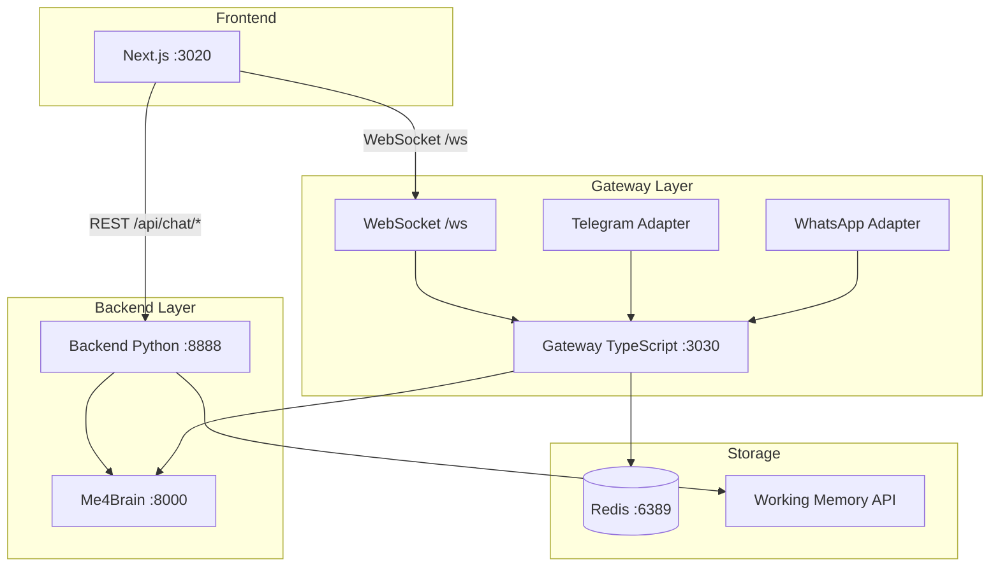

# Piano di Implementazione - Architettura Ibrida

**Versione:** 2.0 (Architettura Ibrida)  
**Data:** 2026-02-17  
**Decisione architetturale:** Gateway per WebSocket/canali, Backend Python per API REST  
**Basato su:** `docs/reports/ARCHITECTURE_ANALYSIS_GATEWAY_VS_BACKEND.md`

---

## 📋 Architettura Target



### Divisione Responsabilità

| Componente             | Responsabilità                                 | Porta |
| ---------------------- | ---------------------------------------------- | ----- |
| **Frontend**           | UX, UI                                         | 3020  |
| **Gateway TypeScript** | WebSocket, Canali (Telegram, WhatsApp), Health | 3030  |
| **Backend Python**     | API REST, Sessioni, Integrazione Me4Brain      | 8888  |
| **Me4Brain**           | Cervello AI, Tool Calling, Memoria             | 8000  |

### Routing Frontend

```typescript
// Configurazione URL
const API_REST_URL = 'http://GIC-com:8888';     // Backend Python
const WEBSOCKET_URL = 'ws://GIC-com:3030/ws';   // Gateway TypeScript
```

---

## 🔴 FASE 1: Hotfix Critici

### TASK 1.1: Aggiornare start.sh per Avviare Backend Python

**File:** `persan/scripts/start.sh`

**Modifica:**

```bash
# FILE: persan/scripts/start.sh
# AGGIUNGERE dopo la sezione Gateway (dopo linea 116)

# =============================================================================
# 3.5. Avvia Backend Python (background)
# =============================================================================
echo -e "\n${YELLOW}[3.5/4] Avvio Backend Python...${NC}"

BACKEND_LOG="/tmp/persan-backend.log"
> "$BACKEND_LOG"  # clear log

cd "$PROJECT_DIR/backend"

# Verifica che .env esista
if [ ! -f "$PROJECT_DIR/.env" ]; then
    echo -e "${RED}  ✗ File .env non trovato in $PROJECT_DIR${NC}"
    exit 1
fi

# Avvio in background con nohup
nohup python -m uvicorn main:app --host 0.0.0.0 --port 8888 --env-file "$PROJECT_DIR/.env" > "$BACKEND_LOG" 2>&1 &
BACKEND_PID=$!
disown $BACKEND_PID

echo -e "${YELLOW}  → Backend PID: $BACKEND_PID${NC}"

# Attendi che sia pronto
echo -e "${YELLOW}  → Attendo avvio Backend...${NC}"
for i in $(seq 1 15); do
    if curl -s --connect-timeout 1 http://localhost:8888/api/health > /dev/null 2>&1; then
        echo -e "${GREEN}  ✓ Backend pronto su http://localhost:8888${NC}"
        break
    fi
    if ! kill -0 $BACKEND_PID 2>/dev/null; then
        echo -e "${RED}  ✗ Backend crashato! Log:${NC}"
        tail -20 "$BACKEND_LOG"
        exit 1
    fi
    sleep 1
done
```

**Aggiornare anche lo summary finale:**

```bash
# Modificare la sezione Summary (dopo linea 152)
echo -e "\n${GREEN}════════════════════════════════════════════════════════════${NC}"
echo -e "${GREEN}  PersAn Dev Stack avviato!${NC}"
echo -e "${GREEN}  ────────────────────────────────────────────────────────${NC}"
echo -e "${GREEN}  Frontend:  http://localhost:3020  (PID: $FRONTEND_PID)${NC}"
echo -e "${GREEN}  Gateway:   http://localhost:3030  (PID: $GATEWAY_PID)${NC}"
echo -e "${GREEN}  Backend:   http://localhost:8888  (PID: $BACKEND_PID)${NC}"
echo -e "${GREEN}  ────────────────────────────────────────────────────────${NC}"
echo -e "${CYAN}  Log Gateway:  tail -f $GATEWAY_LOG${NC}"
echo -e "${CYAN}  Log Frontend: tail -f $FRONTEND_LOG${NC}"
echo -e "${CYAN}  Log Backend:  tail -f $BACKEND_LOG${NC}"
echo -e "${GREEN}════════════════════════════════════════════════════════════${NC}"
```

---

### TASK 1.2: Aggiornare stop.sh per Terminare Backend Python

**File:** `persan/scripts/stop.sh`

**Modifica:**

```bash
# FILE: persan/scripts/stop.sh
# AGGIUNGERE dopo linea 18

# Backend Python
if pgrep -f "uvicorn.*8888" > /dev/null 2>&1; then
    echo -e "${YELLOW}  → Termino Backend Python...${NC}"
    pkill -f "uvicorn.*8888" 2>/dev/null || true
fi

# AGGIUNGERE alla lista porte (linea 27)
for PORT in 3020 3030 8888; do
```

---

### TASK 1.3: Fix CORS Backend Python

**File:** `persan/backend/main.py`

**Modifica:**

```python
# FILE: persan/backend/main.py
# MODIFICA: Linee 17-26

# PRIMA:
app.add_middleware(
    CORSMiddleware,
    allow_origins=[
        "http://localhost:3020",
        "http://127.0.0.1:3020",
    ],
    ...
)

# DOPO:
import os

# Leggi allowed origins da environment
ALLOWED_ORIGINS = os.getenv("CORS_ALLOWED_ORIGINS", "http://localhost:3020,http://127.0.0.1:3020").split(",")

# In produzione, aggiungi anche il dominio GIC-com
if os.getenv("ENVIRONMENT") == "production":
    ALLOWED_ORIGINS.extend([
        "http://GIC-com:3020",
        "http://100.99.43.29:3020",  # Tailscale
    ])

app.add_middleware(
    CORSMiddleware,
    allow_origins=ALLOWED_ORIGINS,
    allow_credentials=True,
    allow_methods=["*"],
    allow_headers=["*"],
)
```

---

### TASK 1.4: Completare Endpoint Mancanti in Backend Python

**File:** `persan/backend/api/routes/chat.py`

**Aggiungere gli endpoint mancanti:**

```python
# FILE: persan/backend/api/routes/chat.py
# AGGIUNGERE dopo linea 259

@router.put("/chat/sessions/{session_id}/config")
async def update_session_config(
    session_id: str,
    config: dict,
    user_id: str = "default",
) -> dict[str, Any]:
    """Update session configuration."""
    me4brain = get_me4brain_service()
    # TODO: Implementare update config in me4brain_service
    return {"status": "updated", "session_id": session_id, "config": config}


@router.delete("/chat/sessions/{session_id}/turns/{turn_index}")
async def delete_session_turn(
    session_id: str,
    turn_index: int,
    user_id: str = "default",
) -> dict[str, Any]:
    """Delete a specific turn from session."""
    me4brain = get_me4brain_service()
    # TODO: Implementare delete turn in me4brain_service
    return {"status": "deleted", "session_id": session_id, "turn_index": turn_index}


@router.put("/chat/sessions/{session_id}/turns/{turn_index}")
async def update_session_turn(
    session_id: str,
    turn_index: int,
    content: str,
    user_id: str = "default",
) -> dict[str, Any]:
    """Update a specific turn and re-execute query."""
    me4brain = get_me4brain_service()
    # TODO: Implementare update turn con re-execution
    return {"status": "updated", "session_id": session_id, "turn_index": turn_index}


@router.post("/chat/sessions/{session_id}/retry/{turn_index}")
async def retry_session_turn(
    session_id: str,
    turn_index: int,
    user_id: str = "default",
):
    """Retry a query from a specific turn."""
    me4brain = get_me4brain_service()
    # TODO: Implementare retry con SSE streaming
    # Questo deve restituire StreamingResponse come /chat
    pass
```

---

### TASK 1.5: Configurare Variabili Ambiente Frontend

**File:** `persan/frontend/.env.production` (NUOVO)

```bash
# FILE: persan/frontend/.env.production
# Configurazione per produzione su GIC-com - ARCHITETTURA IBRIDA

# Backend Python - API REST
NEXT_PUBLIC_API_URL=http://GIC-com:8888

# Gateway TypeScript - WebSocket
NEXT_PUBLIC_GATEWAY_URL=ws://GIC-com:3030/ws

# Environment
NEXT_PUBLIC_ENV=production

# Push Notifications
NEXT_PUBLIC_VAPID_PUBLIC_KEY=BL4oiu3dW48y7DG0O3nuJixDGVaXMjepI4aYvlAI4bbnDRVawfUO3NaAUB7KDpXZ6dO7_HLfD3jxjvpZKb0mrCo
```

**File:** `persan/frontend/.env.development` (NUOVO)

```bash
# FILE: persan/frontend/.env.development
# Configurazione per sviluppo locale - ARCHITETTURA IBRIDA

# Backend Python - API REST
NEXT_PUBLIC_API_URL=http://localhost:8888

# Gateway TypeScript - WebSocket
NEXT_PUBLIC_GATEWAY_URL=ws://localhost:3030/ws

# Environment
NEXT_PUBLIC_ENV=development
```

---

### TASK 1.6: Aggiornare Configurazione Frontend

**File:** `persan/frontend/src/lib/config.ts` (NUOVO)

```typescript
// FILE: persan/frontend/src/lib/config.ts
/**
 * Configurazione centralizzata per architettura ibrida.
 * 
 * - API REST → Backend Python (porta 8888)
 * - WebSocket → Gateway TypeScript (porta 3030)
 */

interface ApiConfig {
    restUrl: string;
    websocketUrl: string;
    timeout: number;
}

function getApiConfig(): ApiConfig {
    // In SSR, usa fallback
    if (typeof window === 'undefined') {
        return {
            restUrl: process.env.NEXT_PUBLIC_API_URL || 'http://localhost:8888',
            websocketUrl: process.env.NEXT_PUBLIC_GATEWAY_URL || 'ws://localhost:3030/ws',
            timeout: 300000,  // 5 minuti
        };
    }
    
    // In browser, valida configurazione
    const restUrl = process.env.NEXT_PUBLIC_API_URL;
    const websocketUrl = process.env.NEXT_PUBLIC_GATEWAY_URL;
    
    if (!restUrl) {
        console.error('🔴 NEXT_PUBLIC_API_URL non configurato!');
        // Fallback dinamico basato su hostname
        const host = window.location.hostname;
        return {
            restUrl: `http://${host}:8888`,
            websocketUrl: `ws://${host}:3030/ws`,
            timeout: 300000,
        };
    }
    
    return {
        restUrl,
        websocketUrl: websocketUrl || `ws://${new URL(restUrl).hostname}:3030/ws`,
        timeout: parseInt(process.env.NEXT_PUBLIC_API_TIMEOUT || '300000', 10),
    };
}

export const API_CONFIG = getApiConfig();

// Costanti esportate per backward compatibility
export const API_URL = API_CONFIG.restUrl;
export const GATEWAY_URL = API_CONFIG.websocketUrl;
```

---

## 🟠 FASE 2: Stabilizzazione

### TASK 2.1: Aggiornare useChatStore per Nuova Config

**File:** `persan/frontend/src/stores/useChatStore.ts`

**Modifica:**

```typescript
// FILE: persan/frontend/src/stores/useChatStore.ts
// MODIFICA: Inizio file

// PRIMA:
const API_URL = process.env.NEXT_PUBLIC_API_URL || 'http://100.99.43.29:3030';

// DOPO:
import { API_CONFIG } from '@/lib/config';
const API_URL = API_CONFIG.restUrl;  // Ora punta al Backend Python :8888
```

---

### TASK 2.2: Aggiornare useGateway per Nuova Config

**File:** `persan/frontend/src/hooks/useGateway.ts`

**Modifica:**

```typescript
// FILE: persan/frontend/src/hooks/useGateway.ts
// MODIFICA: Inizio file

// PRIMA:
const GATEWAY_URL = process.env.NEXT_PUBLIC_GATEWAY_URL || 'ws://100.99.43.29:3030/ws';

// DOPO:
import { API_CONFIG } from '@/lib/config';
const GATEWAY_URL = API_CONFIG.websocketUrl;  // Punta al Gateway :3030
```

---

### TASK 2.3: Fix Persistenza localStorage

**File:** `persan/frontend/src/stores/useChatStore.ts`

**Modifica:**

```typescript
// FILE: persan/frontend/src/stores/useChatStore.ts
// MODIFICA: Sezione persist (linee 518-550)

export const useChatStore = create<ChatState>()(
    persist(
        (set, get) => ({ /* ... */ }),
        {
            name: 'persan-chat-storage',
            storage: createJSONStorage(() => localStorage),
            // Persistere SOLO currentSessionId, NON i messaggi
            partialize: (state) => ({
                currentSessionId: state.currentSessionId,
            }),
            version: 2,  // Nuova versione per invalidare vecchia cache
            migrate: (persisted: any, version: number) => {
                // Migrazione da vecchio schema
                if (version < 2) {
                    return {
                        currentSessionId: persisted.currentSessionId ?? null,
                    };
                }
                return persisted;
            },
        }
    )
);
```

---

### TASK 2.4: Fix Endpoint PATCH con Body JSON

**File:** `persan/backend/api/routes/chat.py`

**Modifica:**

```python
# FILE: persan/backend/api/routes/chat.py
# MODIFICA: Linee 248-259

# PRIMA:
@router.patch("/chat/sessions/{session_id}")
async def update_session(
    session_id: str,
    title: str,  # Query parameter
    user_id: str = "default",
) -> dict[str, Any]:

# DOPO:
from pydantic import BaseModel

class UpdateSessionRequest(BaseModel):
    title: str

@router.patch("/chat/sessions/{session_id}")
async def update_session(
    session_id: str,
    request: UpdateSessionRequest,  # Body JSON
    user_id: str = "default",
) -> dict[str, Any]:
    """Update session title."""
    me4brain = get_me4brain_service()
    success = await me4brain.update_session_title(session_id, request.title, user_id=user_id)
    if success:
        return {"status": "updated", "session_id": session_id, "title": request.title}
    return {"status": "failed", "session_id": session_id}
```

**File:** `persan/frontend/src/stores/useChatStore.ts`

**Modifica:**

```typescript
// FILE: persan/frontend/src/stores/useChatStore.ts
// MODIFICA: updateSessionTitle

updateSessionTitle: async (sessionId: string, title: string) => {
    try {
        const response = await fetch(
            `${API_CONFIG.restUrl}/api/chat/sessions/${sessionId}`,
            {
                method: 'PATCH',
                headers: { 'Content-Type': 'application/json' },
                body: JSON.stringify({ title }),  // Body JSON
            }
        );
        if (response.ok) {
            set((state) => ({
                sessions: state.sessions.map((s) =>
                    s.session_id === sessionId ? { ...s, title } : s
                ),
            }));
        }
    } catch (error) {
        console.error('Failed to update session title:', error);
    }
},
```

---

## 🟢 FASE 3: Miglioramenti

### TASK 3.1: Health Check Unificato

**File:** `persan/packages/gateway/src/routes/index.ts`

**Aggiungere proxy per health del Backend:**

```typescript
// FILE: persan/packages/gateway/src/routes/index.ts
// AGGIUNGERE

import { FastifyInstance } from 'fastify';
import axios from 'axios';

const BACKEND_URL = process.env.BACKEND_URL || 'http://localhost:8888';

// Health check che verifica anche il Backend Python
app.get('/health/full', async () => {
    const gatewayHealth = {
        status: 'healthy',
        timestamp: new Date().toISOString(),
        uptime: process.uptime(),
    };
    
    let backendHealth = { status: 'unknown' };
    try {
        const response = await axios.get(`${BACKEND_URL}/api/health`, { timeout: 2000 });
        backendHealth = { status: 'healthy', ...response.data };
    } catch (error) {
        backendHealth = { status: 'unhealthy', error: String(error) };
    }
    
    return {
        gateway: gatewayHealth,
        backend: backendHealth,
        overall: backendHealth.status === 'healthy' ? 'healthy' : 'degraded',
    };
});
```

---

## 📋 Checklist Implementazione

### Fase 1 - Hotfix

- [ ] **TASK 1.1:** Aggiornare `start.sh` per avviare Backend Python
- [ ] **TASK 1.2:** Aggiornare `stop.sh` per terminare Backend Python
- [ ] **TASK 1.3:** Fix CORS Backend Python
- [ ] **TASK 1.4:** Completare endpoint mancanti in Backend Python
- [ ] **TASK 1.5:** Creare `.env.production` e `.env.development`
- [ ] **TASK 1.6:** Creare `lib/config.ts` centralizzato
- [ ] **VERIFICA:** Test avvio completo (3 processi)

### Fase 2 - Stabilizzazione

- [ ] **TASK 2.1:** Aggiornare `useChatStore` per nuova config
- [ ] **TASK 2.2:** Aggiornare `useGateway` per nuova config
- [ ] **TASK 2.3:** Fix persistenza localStorage
- [ ] **TASK 2.4:** Fix endpoint PATCH con body JSON
- [ ] **VERIFICA:** Test sessioni desktop e mobile

### Fase 3 - Miglioramenti

- [ ] **TASK 3.1:** Health check unificato
- [ ] **VERIFICA:** Test completo su GIC-com

---

## 🧪 Test Plan

### Test 1: Avvio Completo

```bash
# 1. Eseguire start.sh
bash persan/scripts/start.sh

# 2. Verificare 3 processi attivi
curl http://localhost:3020  # Frontend
curl http://localhost:3030/health  # Gateway
curl http://localhost:8888/api/health  # Backend Python
```

### Test 2: Routing Corretto

```bash
# API REST deve andare al Backend Python
curl http://localhost:8888/api/chat/sessions

# WebSocket deve andare al Gateway
wscat -c ws://localhost:3030/ws
```

### Test 3: Persistenza Sessioni

```bash
# 1. Creare sessione via Backend Python
curl -X POST http://localhost:8888/api/chat/sessions

# 2. Verificare in Me4Brain Working Memory
curl http://localhost:8000/v1/working/sessions
```

---

## 📊 Metriche di Successo

| Metrica                     | Prima                | Target                    |
| --------------------------- | -------------------- | ------------------------- |
| Processi avviati            | 2                    | 3                         |
| Endpoint REST               | Gateway (incompleti) | Backend Python (completi) |
| WebSocket                   | Gateway              | Gateway (invariato)       |
| Sessioni perse dopo refresh | 100%                 | 0%                        |
| CORS error                  | Sì                   | No                        |

---

**Piano aggiornato da:** Architect Mode  
**File salvato in:** `plans/PERSAN_FRONTEND_IMPLEMENTATION_PLAN_V2_HYBRID.md`
