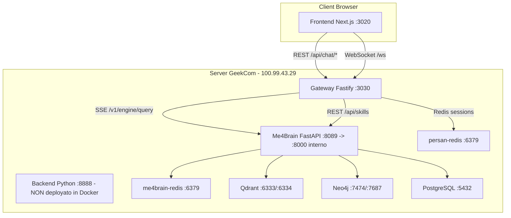

# Piano di Risoluzione PersAn + Me4Brain

**Data:** 2026-02-18  
**Stato Server GeekCom:** Me4Brain ✅ healthy | Gateway ✅ healthy | Frontend ✅ caricato | Chat ❌ bloccata  

---

## Sommario Esecutivo

L'analisi completa di codebase, commit GitHub degli ultimi 2 giorni, e test live sul server GeekCom (100.99.43.29) ha identificato **13 bug** classificati per severità. Il problema principale che blocca la chat è il **BUG 1** (crypto.randomUUID), ma ci sono diversi problemi secondari che degradano il sistema.

---

## Architettura Attuale (Riferimento)



---

## 🔴 BUG CRITICI (Bloccano il sistema)

### BUG 1: `crypto.randomUUID()` non disponibile in HTTP — CHAT BLOCCATA
- **Severità:** 🔴 CRITICA — è la causa principale del blocco chat
- **File:** [`gateway-client.ts:154`](../persan/frontend/src/lib/gateway-client.ts:154)
- **Sintomo:** Errore JavaScript nella console: `TypeError: crypto.randomUUID is not a function`
- **Causa:** `crypto.randomUUID()` è disponibile solo in contesti sicuri (HTTPS o localhost). Il deployment produzione usa `http://100.99.43.29:3020` (HTTP su IP Tailscale)
- **Impatto:** I messaggi WebSocket non possono essere inviati → la chat si blocca dopo l'invio con "Attendere..." infinito
- **Fix:**
  ```typescript
  // In gateway-client.ts:154
  // PRIMA (broken in HTTP):
  const reqId = requestId ?? crypto.randomUUID();
  
  // DOPO (cross-compatible):
  function generateUUID(): string {
      // Fallback per contesti non-sicuri (HTTP)
      if (typeof crypto !== 'undefined' && crypto.randomUUID) {
          return crypto.randomUUID();
      }
      // Polyfill UUID v4
      return 'xxxxxxxx-xxxx-4xxx-yxxx-xxxxxxxxxxxx'.replace(/[xy]/g, (c) => {
          const r = (Math.random() * 16) | 0;
          const v = c === 'x' ? r : (r & 0x3) | 0x8;
          return v.toString(16);
      });
  }
  
  const reqId = requestId ?? generateUUID();
  ```

### BUG 2: Skills endpoint 502 — Skills panel sempre in errore
- **Severità:** 🔴 ALTA
- **File:** [`skills.ts:20`](../persan/packages/gateway/src/routes/skills.ts:20) → chiama `me4brain.skills.list()`
- **File:** [`api/main.py:34-48`](src/me4brain/api/main.py:34) — il router `skills` **NON è importato né registrato**
- **Sintomo:** "Failed to fetch skills" rosso nella dashboard
- **Causa:** Il file `skills.py` esiste con `prefix="/v1/skills"` ma NON è incluso nel `create_app()`. Il gateway proxy verso Me4Brain riceve 404 → restituisce 502
- **Fix:** Importare e registrare il router skills in `main.py`, oppure verificare quale endpoint il me4brain-client usa effettivamente e mapparlo correttamente

### BUG 3: PATCH session title — body vs query string mismatch
- **Severità:** 🟠 ALTA
- **File gateway:** [`chat.ts:235`](../persan/packages/gateway/src/routes/chat.ts:235) — legge `request.query.title` (query string)
- **File frontend:** [`useChatStore.ts:480`](../persan/frontend/src/stores/useChatStore.ts:480) — invia `body: JSON.stringify({ title })` (body JSON)
- **Sintomo:** L'aggiornamento del titolo sessione fallisce silenziosamente (sempre errore 400 "Title is required")
- **Fix:** Il gateway deve leggere il title dal body:
  ```typescript
  // chat.ts - PATCH handler
  const body = request.body as { title?: string };
  const { title } = body;  // <-- da body, non da query
  ```

---

## 🟠 BUG CON IMPATTO SIGNIFICATIVO

### BUG 4: Me4Brain CORS blocca tutti gli origin in produzione
- **File:** [`api/main.py:205`](src/me4brain/api/main.py:205)
- **Codice:** `allow_origins=["*"] if settings.debug else []`
- **Impatto:** In produzione, nessun origin è permesso. Le chiamate server-to-server dal Gateway non sono affette (CORS è solo browser), ma qualsiasi accesso diretto browser a Me4Brain (docs, test API) è bloccato
- **Fix:** Rendere configurabile da env:
  ```python
  cors_origins = os.environ.get("CORS_ALLOWED_ORIGINS", "").split(",")
  allow_origins = ["*"] if settings.debug else [o.strip() for o in cors_origins if o.strip()]
  ```

### BUG 5: Docker network isolation — fix manuale non persistente
- **File:** [`docker-compose.geekcom.yml`](docker/docker-compose.geekcom.yml)
- **Stato:** Già fixato manualmente (IP hardcoded nel .env), ma il fix non è nel docker-compose
- **Fix:** Assicurare che il servizio `me4brain` sia nella stessa rete degli altri servizi. Il compose attuale è corretto ma il container è stato ricreato manualmente con `docker run` bypassando il compose

### BUG 6: Dockerfile.gateway — porta EXPOSE e healthcheck errate
- **File:** [`Dockerfile.gateway:41,45`](../persan/docker/Dockerfile.gateway:41)
- **Codice:** `EXPOSE 3000` e healthcheck su `localhost:3000`, ma l'app ascolta su `PORT` env (3030)
- **Fix:**
  ```dockerfile
  EXPOSE 3030
  HEALTHCHECK ... CMD curl -f http://localhost:${PORT:-3030}/health || exit 1
  ```

### BUG 7: Due istanze Redis in conflitto su porta 6379
- **File:** [`docker-compose.geekcom.yml`](docker/docker-compose.geekcom.yml) — `me4brain-redis:6379`
- **File:** [`docker-compose.gateway.yml`](../persan/docker/docker-compose.gateway.yml) — `persan-redis:6379`
- **Impatto:** Entrambi espongono Redis sulla porta host 6379. Conflitto se avviati insieme
- **Fix:** Cambiare la porta host di persan-redis a 6380:
  ```yaml
  ports:
    - "6380:6379"
  ```

### BUG 8: useApproval.ts — URL WebSocket hardcoded
- **File:** [`useApproval.ts:14`](../persan/frontend/src/hooks/useApproval.ts:14)
- **Codice:** `const GATEWAY_URL = process.env.NEXT_PUBLIC_GATEWAY_URL ?? 'ws://localhost:3030/ws';`
- **Impatto:** Funziona solo in locale, in produzione usa il fallback su localhost → non raggiunge il server
- **Fix:** Usare `API_CONFIG.websocketUrl` come negli altri hook

### BUG 9: useVoice.ts — porta default errata
- **File:** [`useVoice.ts:90`](../persan/frontend/src/hooks/useVoice.ts:90)
- **Codice:** Fallback su `http://localhost:3000` (porta sbagliata, dovrebbe essere 3030)
- **Fix:** Usare `API_CONFIG.restUrl` al posto del default hardcoded

### BUG 10: gateway-client.ts singleton — IP hardcoded
- **File:** [`gateway-client.ts:211`](../persan/frontend/src/lib/gateway-client.ts:211)
- **Codice:** `const url = process.env.NEXT_PUBLIC_GATEWAY_URL ?? 'ws://100.99.43.29:3030/ws';`
- **Impatto:** Il fallback hardcoda l'IP Tailscale — rompe l'accesso da altri dispositivi
- **Fix:** Usare `API_CONFIG.websocketUrl` dal modulo config centralizzato

---

## 🟡 BUG MINORI / MIGLIORAMENTI

### BUG 11: QueryExecutor non propaga errori al client
- **File:** [`query_executor.ts:41-43`](../persan/packages/gateway/src/services/query_executor.ts:41) nel report diagnostico
- **Impatto:** Se il background task fallisce, il client rimane in stato "Attendere..." per sempre
- **Fix:** Inviare messaggio di errore via WebSocket al client quando la background task fallisce

### BUG 12: Settings defaults non corrispondono alle porte produzione
- **File:** [`settings.py:56,36,78,77`](src/me4brain/config/settings.py:56)
- **Porte default:** Redis=6389, PostgreSQL=5489, Neo4j Bolt=7697, Neo4j HTTP=7478
- **Porte produzione:** Redis=6379, PostgreSQL=5432, Neo4j Bolt=7687, Neo4j HTTP=7474
- **Impatto:** Funziona perché env vars sovrascrivono, ma confuso per nuovi sviluppatori
- **Fix:** Allineare i default alle porte standard

### BUG 13: ActivityTimeline non mostra il thought process
- **File:** [`ActivityTimeline.tsx:74-76`](../persan/frontend/src/components/chat/ActivityTimeline.tsx:74)
- **Codice:** `if (!isStreaming || activitySteps.length === 0) return null;`
- **Impatto:** Anche quando lo streaming funziona, la timeline potrebbe non popolarsi se gli eventi non sono mappati correttamente dal WebSocket
- **Fix:** Verificare il mapping degli eventi SSE → activitySteps nel hook useGateway

---

## Piano di Esecuzione (Priorità d'impatto)

### Fase 1: Fix blocco chat (BUG 1 + 3 + 11)
- [ ] **FIX-1a**: Sostituire `crypto.randomUUID()` con polyfill in [`gateway-client.ts`](../persan/frontend/src/lib/gateway-client.ts:154)
- [ ] **FIX-1b**: Aggiungere polyfill anche in altri punti che usano `crypto.randomUUID`
- [ ] **FIX-3**: Cambiare `request.query.title` → `request.body.title` in [`chat.ts:235`](../persan/packages/gateway/src/routes/chat.ts:235)
- [ ] **FIX-11**: Aggiungere error propagation nel QueryExecutor

### Fase 2: Fix Skills e API (BUG 2 + 4)
- [ ] **FIX-2**: Registrare il router skills in Me4Brain `main.py` O verificare che il me4brain-client mappi agli endpoint corretti
- [ ] **FIX-4**: Aggiungere CORS configurabile da env var in `api/main.py`

### Fase 3: Fix URL hardcoded (BUG 8 + 9 + 10)
- [ ] **FIX-8**: Sostituire URL hardcoded in `useApproval.ts` con `API_CONFIG`
- [ ] **FIX-9**: Fixare porta default in `useVoice.ts`
- [ ] **FIX-10**: Usare `API_CONFIG` nel singleton `gateway-client.ts`

### Fase 4: Fix Docker/Deployment (BUG 5 + 6 + 7)
- [ ] **FIX-5**: Ricreare container me4brain via docker-compose (non docker run manuale)
- [ ] **FIX-6**: Fixare EXPOSE e healthcheck in Dockerfile.gateway
- [ ] **FIX-7**: Separare porte Redis host (me4brain=6379, persan=6380)

### Fase 5: Pulizia defaults (BUG 12 + 13)
- [ ] **FIX-12**: Allineare default porte in settings.py
- [ ] **FIX-13**: Verificare mapping eventi ActivityTimeline

### Fase 6: Rebuild e Deploy
- [ ] Rebuild immagine Docker frontend PersAn (per applicare fix JS)
- [ ] Rebuild immagine Docker gateway PersAn
- [ ] Rebuild immagine Docker Me4Brain (se fix Python)
- [ ] Restart stack completo via docker-compose
- [ ] Test end-to-end: invio messaggio → streaming → risposta

---

## Commit Che Hanno Introdotto i Problemi

| Bug      | Commit Probabile             | Descrizione                                                                                              |
| -------- | ---------------------------- | -------------------------------------------------------------------------------------------------------- |
| BUG 1    | `38a3cac` PersAn             | Hybrid architecture implementation - probabilmente ha introdotto il gateway-client con crypto.randomUUID |
| BUG 2    | `664f470` Me4Brain           | Unify tools/skills registry - ha deprecato/rinominato gli endpoint skills                                |
| BUG 3    | `38a3cac` PersAn             | Hybrid architecture - nuovo chat routing con mismatch body/query                                         |
| BUG 8-10 | `9558179` + `a74cebb` PersAn | Dynamic gateway URL + production fallbacks - fix parziali con residui hardcoded                          |

---

## Test di Verifica Post-Fix

```bash
# 1. Health checks
curl http://100.99.43.29:8089/health        # Me4Brain
curl http://100.99.43.29:3030/health        # Gateway
curl http://100.99.43.29:3030/health/full   # Gateway + Backend

# 2. Skills endpoint
curl http://100.99.43.29:3030/api/skills

# 3. Chat SSE (test diretto)
curl -X POST http://100.99.43.29:3030/api/chat \
  -H "Content-Type: application/json" \
  -d '{"message": "ciao test"}' \
  --no-buffer

# 4. Session management
curl http://100.99.43.29:3030/api/chat/sessions
curl -X POST http://100.99.43.29:3030/api/chat/sessions
```

---

**File generato da:** Architect Mode Analysis  
**Basato su:** Analisi codebase + 4 commit Me4Brain + 20 commit PersAn + test live server  
