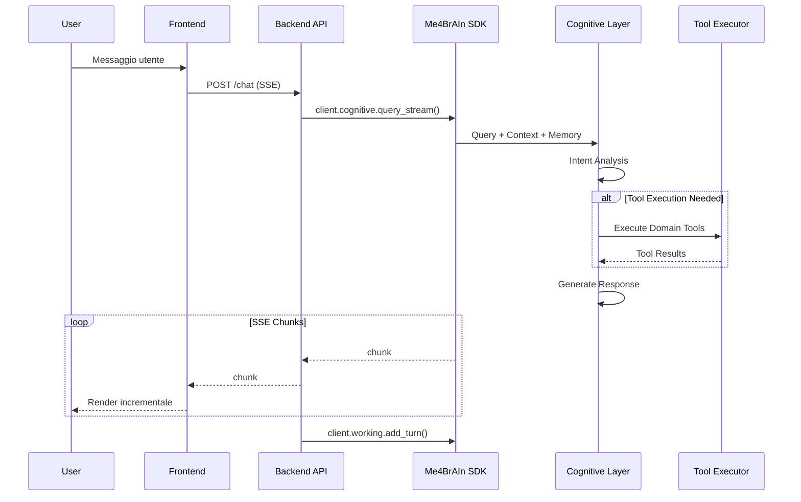

# 🤖 Blueprint PersAn v1.0

> **Tipo**: AI Chatbot Universale  
> **Motore**: Me4BrAIn Agentic Memory Platform (esclusivo)  
> **Data**: 30 Gennaio 2026  
> **Stato**: Draft per Review

---

## 1. Vision & Obiettivi

### 1.1 Cos'è PersAn

PersAn è un **chatbot conversazionale universale** in stile ChatGPT/Perplexity che utilizza **Me4BrAIn** come unico backend per:

1. **Memoria RAG multi-livello** (Working, Episodic, Semantic, Procedural)
2. **Esecuzione di tool agentici** (118 tool su 14 domini)
3. **Inferenza LLM** tramite il cognitive layer di Me4BrAIn

### 1.2 Obiettivi Chiave

| Obiettivo         | Descrizione                                                     |
| ----------------- | --------------------------------------------------------------- |
| **Universalità**  | Interfaccia unica per accedere a tutti i 14 domini di Me4BrAIn |
| **Context-Aware** | Memoria conversazionale persistente tra sessioni                |
| **Agentic**       | Esecuzione automatica di tool in base all'intent                |
| **Estensibilità** | Architettura modulare per nuovi domini/tool                     |

---

## 2. Architettura Sistema

### 2.1 Stack Tecnologico

```
┌─────────────────────────────────────────────────────────────┐
│                     FRONTEND (Next.js 15)                    │
│  ┌─────────────┐  ┌──────────────────┐  ┌────────────────┐  │
│  │  Sidebar    │  │   Chat Panel     │  │  Context Panel │  │
│  │  (Sessions) │  │   (Main UI)      │  │  (Intel Deck)  │  │
│  └─────────────┘  └──────────────────┘  └────────────────┘  │
└─────────────────────────────────────────────────────────────┘
                              │
                              ▼ SSE/REST
┌─────────────────────────────────────────────────────────────┐
│                    BACKEND (FastAPI)                         │
│  ┌──────────────────────────────────────────────────────┐   │
│  │              PersAn Gateway API                   │   │
│  │   /chat  /sessions  /memory  /tools  /domains        │   │
│  └──────────────────────────────────────────────────────┘   │
└─────────────────────────────────────────────────────────────┘
                              │
                              ▼ me4brain-sdk
┌─────────────────────────────────────────────────────────────┐
│                     ME4BRAIN CORE                           │
│  ┌─────────┐ ┌─────────┐ ┌─────────┐ ┌─────────────────┐   │
│  │ Working │ │Episodic │ │Semantic │ │    Procedural   │   │
│  │ Memory  │ │ Memory  │ │ Memory  │ │  Memory (Tools) │   │
│  └─────────┘ └─────────┘ └─────────┘ └─────────────────┘   │
│  ┌─────────────────────────────────────────────────────┐   │
│  │            Cognitive Layer (LLM + RAG)               │   │
│  └─────────────────────────────────────────────────────┘   │
│  ┌─────────────────────────────────────────────────────┐   │
│  │        14 Domain Handlers (118 Tools)                │   │
│  └─────────────────────────────────────────────────────┘   │
└─────────────────────────────────────────────────────────────┘
```

### 2.2 Flusso Dati Conversazionale



---

## 3. Componenti Frontend

### 3.1 Layout a 3 Colonne

Ispirato a Consultos `DashboardLayout.tsx`, utilizziamo `react-resizable-panels`:

```
┌──────────────────────────────────────────────────────────────┐
│  TopBar: Logo + Status Me4BrAIn + Quick Actions             │
├────────────┬───────────────────────────────┬─────────────────┤
│  SIDEBAR   │         CHAT PANEL            │   INTEL DECK    │
│  (20%)     │            (55%)              │     (25%)       │
│            │                               │                 │
│ [Sessions] │  ┌─────────────────────────┐  │ [Sources][...]  │
│ [Domains]  │  │     Message History     │  │ ┌─────────────┐ │
│ ──────────-│  │     (MessageBubble)     │  │ │ Source 1    │ │
│ • Chat 1   │  │                         │  │ │ Source 2    │ │
│ • Chat 2   │  └─────────────────────────┘  │ │ Source N    │ │
│ • Chat 3   │  ┌─────────────────────────┐  │ └─────────────┘ │
│            │  │    Input + Attachments  │  │                 │
│            │  └─────────────────────────┘  │                 │
├────────────┴───────────────────────────────┴─────────────────┤
│  StatusBar: Connected to Me4BrAIn | Active Session | Tools  │
└──────────────────────────────────────────────────────────────┘
```

#### Sidebar Sinistra - Due Viste Selezionabili

| Vista        | Descrizione                                              |
| ------------ | -------------------------------------------------------- |
| **Sessions** | Lista cronologica delle chat (stile ChatGPT)             |
| **Domains**  | Raggruppamento sessioni per dominio Me4BrAIn utilizzato |

La vista **Domains** analizza ogni sessione e la classifica in base al dominio principale utilizzato (es. se una chat ha usato tool `finance_crypto`, appare sotto quella categoria).

#### Intel Deck Destra - Sistema a Schede

| Tab         | Contenuto                                             | Priorità |
| ----------- | ----------------------------------------------------- | -------- |
| **Sources** | Fonti citate nelle risposte LLM, link a documenti/URL | MVP      |
| **Memory**  | Contesto memoria episodica/semantica rilevante        | Fase 2   |
| **Tools**   | Dettagli esecuzioni tool con parametri/risultati      | Fase 2   |
| **Graph**   | Visualizzazione knowledge graph correlato             | Fase 3   |

### 3.2 Componenti Chiave

| Componente        | Responsabilità                                   | Ispirazione              |
| ----------------- | ------------------------------------------------ | ------------------------ |
| `DashboardLayout` | Layout 3 colonne ridimensionabile                | Consultos                |
| `SessionSidebar`  | Gestione sessioni con toggle Sessions/Domains    | ChatGPT                  |
| `DomainGroupView` | Vista sessioni raggruppate per dominio           | Custom                   |
| `ChatPanel`       | Area messaggi + input                            | Endogram `ChatPanel.tsx` |
| `MessageBubble`   | Rendering messaggi con markdown/code             | Endogram                 |
| `ThoughtStream`   | Visualizzazione reasoning steps                  | Endogram                 |
| `IntelDeck`       | Container schede (Sources, Memory, Tools, Graph) | Custom                   |
| `SourcesTab`      | Lista fonti citate nelle risposte                | Custom                   |
| `ToolResultCard`  | Visualizzazione risultati tool                   | Custom                   |

### 3.3 Feature UI

- **Streaming SSE**: Rendering incrementale risposte
- **Markdown + Syntax Highlighting**: Per code blocks
- **File Upload**: Immagini e documenti per analisi
- **Reasoning Steps**: Visualizzazione catena di pensiero
- **Tool Indicators**: Badge per tool utilizzati
- **Sources Panel**: Link alle fonti nelle risposte LLM

---

## 4. Componenti Backend

### 4.1 API Routes

```python
# PersAn Backend Gateway (FastAPI)

# === Chat ===
POST   /api/chat              # Query conversazionale (SSE streaming)
POST   /api/chat/simple       # Query semplice (JSON response)

# === Sessions ===
GET    /api/sessions          # Lista sessioni utente
POST   /api/sessions          # Nuova sessione
GET    /api/sessions/{id}     # Dettagli sessione
DELETE /api/sessions/{id}     # Elimina sessione
GET    /api/sessions/{id}/history  # Cronologia messaggi

# === Memory ===
GET    /api/memory/episodic   # Cerca memoria episodica
GET    /api/memory/semantic   # Cerca knowledge graph
POST   /api/memory/store      # Memorizza episodio manuale

# === Tools ===
GET    /api/tools             # Lista tool disponibili
GET    /api/tools/categories  # Categorie tool
POST   /api/tools/execute     # Esecuzione diretta tool

# === Domains ===
GET    /api/domains           # Lista domini attivi
GET    /api/domains/{name}    # Info dominio specifico

# === Status ===
GET    /api/health            # Health check
GET    /api/status            # Status Me4BrAIn connection
```

### 4.2 Servizi Backend

```python
# services/me4brain_service.py
class Me4BrAInService:
    """Client wrapper per me4brain-sdk con caching e error handling."""
    
    def __init__(self):
        self.client = AsyncMe4BrAInClient(
            base_url=settings.ME4BRAIN_URL,  # http://localhost:8000
            api_key=settings.ME4BRAIN_API_KEY,
            timeout=60.0,
        )
    
    async def query(self, 
        message: str, 
        session_id: str,
        attachments: list = None,
    ) -> AsyncIterator[StreamChunk]:
        """Query cognitiva con streaming."""
        async for chunk in self.client.cognitive.query_stream(
            query=message,
            session_id=session_id,
        ):
            yield chunk
    
    async def get_session_context(self, session_id: str) -> SessionContext:
        """Ottiene contesto working memory."""
        return await self.client.working.get_context(
            session_id=session_id,
            max_turns=20,
        )
    
    async def search_episodic(self, query: str, limit: int = 10):
        """Ricerca memoria episodica."""
        return await self.client.episodic.search(query=query, limit=limit)
    
    async def search_semantic(self, query: str, limit: int = 10):
        """Ricerca knowledge graph."""
        return await self.client.semantic.search(query=query, limit=limit)
```

### 4.3 Integrazione Domini

PersAn espone **tutti i 14 domini** di Me4BrAIn in modo trasparente:

| Dominio            | Tools | Esempi Query                                         |
| ------------------ | ----- | ---------------------------------------------------- |
| `finance_crypto`   | 20    | "Prezzo Bitcoin", "Andamento AAPL"                   |
| `google_workspace` | 38    | "Prossimi eventi calendario", "Cerca email di Mario" |
| `medical`          | 8     | "Interazioni warfarin", "Cerca su PubMed"            |
| `science_research` | 7     | "Paper su transformer", "DOI lookup"                 |
| `sports_nba`       | 7     | "Stats LeBron", "Partite oggi"                       |
| `web_search`       | 4     | "Cerca notizie AI", "Wikipedia su X"                 |
| `geo_weather`      | 3     | "Meteo Milano", "Terremoti recenti"                  |
| `entertainment`    | 7     | "Cerca film Inception", "Top tracks Coldplay"        |
| `food`             | 6     | "Ricetta carbonara", "Info nutrizionali"             |
| `travel`           | 5     | "Voli Milano", "Info aeroporto"                      |
| `tech_coding`      | 10    | "Cerca su GitHub", "Esegui codice Python"            |
| `jobs`             | 2     | "Lavori Python remoti"                               |
| `knowledge_media`  | 3     | "Wikipedia AI", "Top news tech"                      |
| `utility`          | 2     | "IP lookup", "URL preview"                           |

---

## 5. Struttura Progetto

```
persan/
├── .env.example                 # Template variabili ambiente
├── .gitignore
├── README.md
├── docker-compose.yml           # Sviluppo locale
├── pyproject.toml               # Backend Python
├── package.json                 # Frontend Node
│
├── backend/                     # FastAPI Backend
│   ├── __init__.py
│   ├── main.py                  # Entry point
│   ├── config.py                # Settings/Environment
│   ├── api/
│   │   ├── __init__.py
│   │   ├── routes/
│   │   │   ├── chat.py          # Chat endpoints
│   │   │   ├── sessions.py      # Session management
│   │   │   ├── memory.py        # Memory endpoints
│   │   │   ├── tools.py         # Tools endpoints
│   │   │   └── health.py        # Health/Status
│   │   └── deps.py              # Dependency injection
│   ├── services/
│   │   ├── __init__.py
│   │   ├── me4brain_service.py # Me4BrAIn SDK wrapper
│   │   ├── session_service.py   # Session logic
│   │   └── streaming.py         # SSE handling
│   └── models/
│       ├── __init__.py
│       ├── chat.py              # Request/Response models
│       └── session.py           # Session models
│
├── frontend/                    # Next.js 15 Frontend
│   ├── package.json
│   ├── next.config.ts
│   ├── tsconfig.json
│   ├── tailwind.config.ts
│   ├── components.json          # shadcn/ui config
│   ├── public/
│   ├── src/
│   │   ├── app/
│   │   │   ├── layout.tsx       # Root layout
│   │   │   ├── page.tsx         # Main page
│   │   │   └── globals.css      # Global styles
│   │   ├── components/
│   │   │   ├── layout/
│   │   │   │   ├── DashboardLayout.tsx
│   │   │   │   ├── TopBar.tsx
│   │   │   │   └── StatusBar.tsx
│   │   │   ├── sidebar/
│   │   │   │   ├── SessionSidebar.tsx
│   │   │   │   ├── SessionItem.tsx
│   │   │   │   └── NewSessionButton.tsx
│   │   │   ├── chat/
│   │   │   │   ├── ChatPanel.tsx
│   │   │   │   ├── MessageBubble.tsx
│   │   │   │   ├── ThoughtStream.tsx
│   │   │   │   ├── ChatInput.tsx
│   │   │   │   └── FileUpload.tsx
│   │   │   ├── intel/
│   │   │   │   ├── IntelDeck.tsx
│   │   │   │   ├── MemoryContext.tsx
│   │   │   │   ├── ToolResultCard.tsx
│   │   │   │   └── SourcesList.tsx
│   │   │   └── ui/              # shadcn/ui components
│   │   ├── hooks/
│   │   │   ├── useChat.ts       # Chat state/SSE
│   │   │   ├── useSessions.ts   # Session management
│   │   │   └── useMe4BrAIn.ts  # SDK client hook
│   │   ├── stores/
│   │   │   ├── useChatStore.ts  # Zustand chat state
│   │   │   ├── useSessionStore.ts
│   │   │   └── useUIStore.ts
│   │   ├── lib/
│   │   │   ├── api.ts           # API client
│   │   │   └── utils.ts
│   │   └── types/
│   │       ├── chat.ts
│   │       └── session.ts
│
├── docs/
│   ├── architecture/
│   │   └── decisions/           # ADR
│   └── api/
│       └── openapi.yaml
│
└── scripts/
    ├── start_dev.sh             # Start development
    └── setup.sh                 # Initial setup
```

---

## 6. Configurazione Ambiente

### 6.1 Variabili Ambiente

```env
# === Me4BrAIn Connection ===
ME4BRAIN_URL=http://localhost:8000
ME4BRAIN_API_KEY=                    # Opzionale in dev

# === Backend ===
PERSAN_PORT=8888
PERSAN_HOST=0.0.0.0
DEBUG=true

# === Frontend ===
NEXT_PUBLIC_API_URL=http://localhost:8888
NEXT_PUBLIC_WS_URL=ws://localhost:8888

# === Auth (predisposto, disabilitato in dev) ===
AUTH_ENABLED=false
```

> **⚠️ Nota**: Le sessioni sono gestite **esclusivamente** da Me4BrAIn Working Memory.  
> Non serve database locale - Me4BrAIn è il motore di persistenza.

### 6.2 Dipendenze

**Backend (Python 3.11+)**:
```toml
[project]
dependencies = [
    "fastapi>=0.115.0",
    "uvicorn[standard]>=0.34.0",
    "me4brain-sdk>=0.1.0",    # Link locale
    "pydantic>=2.10.0",
    "python-multipart>=0.0.18",
    "sse-starlette>=2.2.0",
]
```

**Frontend (Node 20+)**:
```json
{
  "dependencies": {
    "next": "^15.0.0",
    "react": "^19.0.0",
    "react-resizable-panels": "^2.0.0",
    "zustand": "^5.0.0",
    "@tanstack/react-query": "^5.0.0",
    "lucide-react": "^0.400.0",
    "tailwindcss": "^4.0.0"
  }
}
```

---

## 7. Fasi di Implementazione

### Fase 1: Fondamenta (1-2 giorni)

- [ ] Setup progetto (struttura directory, pyproject.toml, package.json)
- [ ] Backend base FastAPI con health check
- [ ] Integrazione `me4brain-sdk` (wrapper service)
- [ ] Frontend Next.js con layout 3 colonne base
- [ ] Connessione frontend-backend verificata

### Fase 2: Chat Core (2-3 giorni)

- [ ] Endpoint `/api/chat` con SSE streaming
- [ ] `ChatPanel` completo (input, message list, scrolling)
- [ ] `MessageBubble` con markdown rendering
- [ ] Integrazione `client.cognitive.query_stream()`
- [ ] Prima query E2E funzionante

### Fase 3: Session Management (1 giorno)

- [ ] API sessions CRUD
- [ ] `SessionSidebar` UI
- [ ] Persistenza working memory (via Me4BrAIn)
- [ ] Switch sessione senza perdita contesto

### Fase 4: Intel Deck (1-2 giorni)

- [ ] `IntelDeck` container
- [ ] `MemoryContext` - visualizzazione episodic hits
- [ ] `ToolResultCard` - rendering risultati tool
- [ ] `ThoughtStream` - reasoning chain visualization

### Fase 5: Polish & Features (2+ giorni)

- [ ] File upload + attachments
- [ ] Dark/Light mode
- [ ] Keyboard shortcuts
- [ ] Mobile responsive (collapsible panels)
- [ ] Settings panel
- [ ] Export conversazioni

---

## 8. Verifica & Testing

### 8.1 Unit Tests

```bash
# Backend
uv run pytest backend/tests/ -v --cov=backend

# Frontend
npm run test --prefix frontend
```

### 8.2 Integration Tests

```bash
# E2E con Me4BrAIn running
uv run pytest backend/tests/integration/ -v --me4brain-url=http://localhost:8000
```

### 8.3 Manual Testing Checklist

1. **Basic Chat Flow**:
   - Avvia Me4BrAIn (`uv run python -m me4brain.api.main`)
   - Avvia PersAn backend (`uv run uvicorn backend.main:app`)
   - Avvia frontend (`npm run dev`)
   - Invia messaggio nella chat
   - Verifica risposta in streaming
   - Verifica rendering markdown

2. **Tool Execution**:
   - Query "Che tempo fa a Milano?" → verifica tool `geo_weather`
   - Query "Prezzo Bitcoin" → verifica tool `finance_crypto`
   - Mostra risultati nell'Intel Deck

3. **Session Persistence**:
   - Crea nuova sessione
   - Invia alcuni messaggi
   - Ricarica pagina
   - Verifica cronologia preservata

---

## 9. Decisioni Architetturali Chiave

### ADR-001: Me4BrAIn come Unico Backend

**Contesto**: PersAn necessita di memoria, LLM, e tool execution.

**Decisione**: Usare **esclusivamente** Me4BrAIn per tutte le funzionalità cognitive.

**Conseguenze**:
- ✅ Architettura semplificata
- ✅ Un solo sistema da mantenere
- ✅ Memoria unificata cross-sessione
- ⚠️ Dipendenza critica da Me4BrAIn

### ADR-002: SSE per Streaming

**Contesto**: Necessità di risposte in tempo reale.

**Decisione**: Server-Sent Events (SSE) invece di WebSocket.

**Conseguenze**:
- ✅ Più semplice di WebSocket per streaming unidirezionale
- ✅ Supporto nativo nei browser
- ✅ Compatibile con HTTP/2

### ADR-003: Zustand per State Management

**Contesto**: Stato frontend per chat, sessioni, UI.

**Decisione**: Zustand invece di Redux/Jotai.

**Conseguenze**:
- ✅ API minimale, meno boilerplate
- ✅ Supporto persist/devtools
- ✅ Già usato in Endogram/Consultos

---

## 10. Rischi & Mitigazioni

| Rischio                     | Probabilità | Impatto | Mitigazione                             |
| --------------------------- | ----------- | ------- | --------------------------------------- |
| Me4BrAIn non raggiungibile | Media       | Alto    | Health check + graceful degradation     |
| Latenza streaming           | Bassa       | Medio   | Timeout configurabili, loading states   |
| Sessioni perse              | Media       | Alto    | Persistenza working memory su Me4BrAIn |
| Overflow memoria client     | Bassa       | Medio   | Virtualized scrolling per chat lunghe   |

---

## 11. Prossimi Passi

1. ✅ **Review Blueprint** - Approvazione utente
2. ⏳ **Setup Progetto** - Scaffold iniziale
3. ⏳ **Integrazione SDK** - Connessione a Me4BrAIn
4. ⏳ **Chat MVP** - Prima query funzionante
5. ⏳ **Deploy Locale** - docker-compose per sviluppo

---

> **Autore**: Antigravity Agent  
> **Versione**: 1.0-draft  
> **Data**: 30 Gennaio 2026
