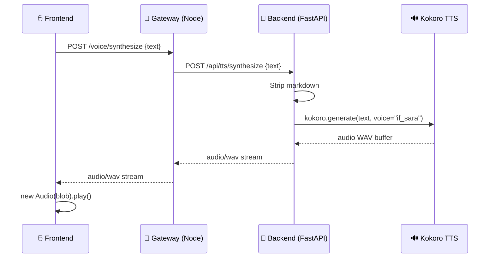

# Text-to-Speech Locale: Lettura Risposte con Voce Naturale

> **Stato**: 💡 Idea — da implementare in futuro  
> **Data**: 2026-02-11

Implementare un pulsante 🔊 su ogni risposta dell'assistente che, cliccato, legge il contenuto con voce naturale italiana usando **Kokoro TTS** — un modello open-source locale (82M parametri, costo zero, qualità elevata).

## Architettura



## Perché Kokoro TTS

- **Locale e gratuito**: nessun costo API, nessuna dipendenza cloud
- **82M parametri**: leggero ma con qualità paragonabile a modelli più grandi
- **Italiano nativo**: voci `if_sara` (femminile) e `im_nicola` (maschile)
- **Open-source**: Apache 2.0, installabile via `pip install kokoro`
- **Prerequisito**: `brew install espeak-ng` su macOS
- **Modello ~300MB**: si scarica automaticamente al primo uso

## Infrastruttura Voice Già Esistente

Il sistema ha già componenti voice parziali pronti da evolvere:

| Componente                | File                                                | Stato                               |
| ------------------------- | --------------------------------------------------- | ----------------------------------- |
| Hook React TTS/STT        | `frontend/src/hooks/useVoice.ts`                    | ✅ Funzionante (Web Speech fallback) |
| Voice Button              | `frontend/src/components/voice/VoiceButton.tsx`     | ✅ Con animazioni                    |
| VoiceService gateway      | `packages/gateway/src/voice/service.ts`             | ⚠️ Stub (delega a browser)           |
| Route `/voice/synthesize` | `packages/gateway/src/routes/voice.ts`              | ⚠️ Stub (JSON, no audio)             |
| Talk Mode Overlay         | `frontend/src/components/voice/TalkModeOverlay.tsx` | ✅ Funzionante                       |

## Modifiche Necessarie

### Backend Python (PersAn)

1. **[NEW] `backend/api/routes/tts.py`** — Router FastAPI `POST /api/tts/synthesize`
   - Accetta `{ text, voice? }`, ritorna audio WAV come `StreamingResponse`
   - Cache LRU per testi già sintetizzati

2. **[NEW] `backend/services/tts_service.py`** — Classe `TTSService`
   - Lazy loading di Kokoro (carica modello solo al primo uso)
   - `synthesize(text, voice="if_sara") -> bytes`
   - `strip_markdown(text)` per pulire il testo

3. **[MODIFY] `backend/main.py`** — Registrare router TTS

### Gateway Node.js

4. **[MODIFY] `packages/gateway/src/voice/service.ts`** — Proxy verso backend Python
5. **[MODIFY] `packages/gateway/src/routes/voice.ts`** — Ritornare audio binary

### Frontend

6. **[MODIFY] `frontend/src/components/chat/MessageBubble.tsx`** — Pulsante 🔊 nella toolbar hover (solo assistant)
7. **[MODIFY] `frontend/src/components/chat/ChatPanel.tsx`** — Integrare `useVoice` hook
8. **[MODIFY] `frontend/src/hooks/useVoice.ts`** — Gestire audio binary dal gateway

### Dipendenze

9. **[MODIFY] `pyproject.toml`** — Aggiungere `kokoro>=0.9.4`, `soundfile`

## Prerequisiti

```bash
brew install espeak-ng
pip install kokoro soundfile
```

## Verifica

1. Avviare il sistema → browser su `http://localhost:3020`
2. Inviare un messaggio e attendere la risposta
3. Hover sulla risposta → icona 🔊 nella toolbar
4. Click → voce italiana naturale
5. Click di nuovo → stop
